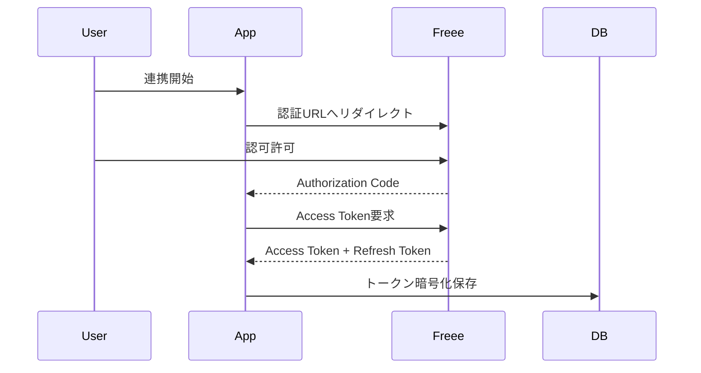
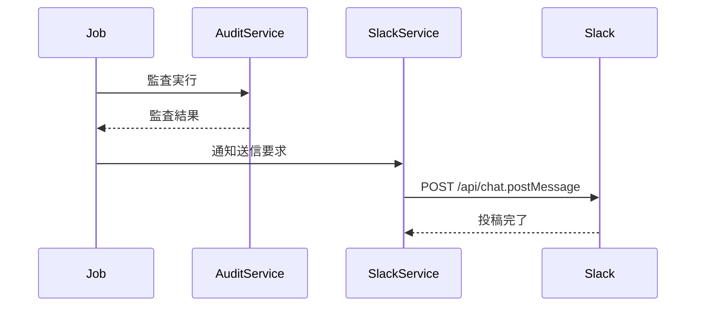

# freee_audit API設計書

## 1. 概要

本ドキュメントは、freee_auditシステムで使用されるAPIの設計を定義します。

### API種別

| 種別 | 説明 |
|------|------|
| freee API | 外部会計API（仕訳、証憑、試算表取得） |
| AI API | OpenAI / Gemini / Claude（証憑分析） |
| 内部API | Next.js API Routes（システム内部通信用） |
| Slack API | 通知送信 |
| Box API | ファイルストレージ |

---

## 2. freee API

### 2.1 認証フロー

#### OAuth 2.0フロー



#### トークン管理

```typescript
interface TokenData {
  accessToken: string      // 暗号化済み
  refreshToken: string     // 暗号化済み
  expiresAt: Date
  tokenType: 'Bearer'
}

// 自動リフレッシュ
class FreeeTokenManager {
  async getValidToken(): Promise<string> {
    if (this.isExpired()) {
      await this.refresh()
    }
    return this.decrypt(this.tokenData.accessToken)
  }

  private isExpired(): boolean {
    return new Date() >= new Date(this.tokenData.expiresAt.getTime() - 5 * 60 * 1000)
  }
}
```

### 2.2 エンドポイント一覧

#### 事業所

| メソッド | エンドポイント | 説明 |
|---------|--------------|------|
| GET | /api/1/companies | 事業所一覧取得 |
| GET | /api/1/companies/{id} | 事業所詳細取得 |

#### 仕訳

| メソッド | エンドポイント | 説明 |
|---------|--------------|------|
| GET | /api/1/journals | 仕訳一覧取得 |
| GET | /api/1/journals/{id} | 仕訳詳細取得 |
| POST | /api/1/journals | 仕訳作成 |

#### 証憑

| メソッド | エンドポイント | 説明 |
|---------|--------------|------|
| GET | /api/1/documents | 証憑一覧取得 |
| GET | /api/1/documents/{id} | 証憑詳細取得 |
| GET | /api/1/documents/{id}/download | 証憑ファイルダウンロード |

#### レポート

| メソッド | エンドポイント | 説明 |
|---------|--------------|------|
| GET | /api/1/reports/trial_balance | 試算表取得 |
| GET | /api/1/reports/balance_sheet | 貸借対照表取得 |
| GET | /api/1/reports/profit_loss | 損益計算書取得 |

#### 勘定科目

| メソッド | エンドポイント | 説明 |
|---------|--------------|------|
| GET | /api/1/account_items | 勘定科目一覧取得 |

### 2.3 クライアント実装

```typescript
interface FreeeClientConfig {
  clientId: string
  clientSecret: string
  redirectUri: string
}

class FreeeClient {
  private baseUrl = 'https://api.freee.co.jp'
  private tokenManager: FreeeTokenManager
  private rateLimiter: RateLimiter

  // 事業所一覧
  async getCompanies(): Promise<Company[]> {
    return this.request('GET', '/api/1/companies')
  }

  // 仕訳一覧
  async getJournals(params: JournalParams): Promise<PaginatedResponse<Journal>> {
    return this.request('GET', '/api/1/journals', { params })
  }

  // 証憑ダウンロード
  async downloadDocument(id: number): Promise<Buffer> {
    const response = await this.request(
      'GET',
      `/api/1/documents/${id}/download`,
      { responseType: 'arraybuffer' }
    )
    return Buffer.from(response)
  }

  // 試算表取得
  async getTrialBalance(params: ReportParams): Promise<TrialBalance> {
    return this.request('GET', '/api/1/reports/trial_balance', { params })
  }
}
```

### 2.4 レートリミット制御

```typescript
interface RateLimitConfig {
  auth: number      // 認証: 10/秒
  data: number      // データ: 5/秒
  report: number    // レポート: 2/秒
}

class FreeeRateLimiter {
  private limits = {
    auth: { max: 10, window: 1000 },
    data: { max: 5, window: 1000 },
    report: { max: 2, window: 1000 }
  }

  async waitForToken(type: keyof typeof this.limits): Promise<void> {
    // トークンバケットアルゴリズム実装
  }
}
```

### 2.5 サーキットブレーカー

```typescript
interface CircuitBreakerConfig {
  failureThreshold: number    // 5回連続失敗でOPEN
  resetTimeout: number        // 60秒後にHALF_OPEN
  halfOpenMaxCalls: number    // HALF_OPEN状態での最大試行回数
}

class FreeeCircuitBreaker {
  private state: 'CLOSED' | 'OPEN' | 'HALF_OPEN' = 'CLOSED'
  private failureCount = 0
  private lastFailureTime: Date | null = null

  async execute<T>(fn: () => Promise<T>): Promise<T> {
    if (this.state === 'OPEN') {
      if (this.shouldAttemptReset()) {
        this.state = 'HALF_OPEN'
      } else {
        throw new CircuitBreakerOpenError()
      }
    }

    try {
      const result = await fn()
      this.onSuccess()
      return result
    } catch (error) {
      this.onFailure()
      throw error
    }
  }

  private onSuccess(): void {
    this.failureCount = 0
    this.state = 'CLOSED'
  }

  private onFailure(): void {
    this.failureCount++
    this.lastFailureTime = new Date()
    if (this.failureCount >= 5) {
      this.state = 'OPEN'
    }
  }

  private shouldAttemptReset(): boolean {
    if (!this.lastFailureTime) return false
    return Date.now() - this.lastFailureTime.getTime() >= 60000
  }
}
```

---

## 3. AI API

### 3.1 概要

設定画面で切替可能なAI APIの統一インターフェースを提供します。

### 3.2 プロバイダー設定

```typescript
type AIProvider = 'openai' | 'gemini' | 'claude'

interface AIConfig {
  provider: AIProvider
  apiKey: string        // 暗号化保存
  model?: string
  temperature?: number
  maxTokens?: number
}
```

### 3.3 統一インターフェース

```typescript
interface AIService {
  analyzeDocument(request: DocumentAnalysisRequest): Promise<DocumentAnalysisResult>
  validateEntry(request: EntryValidationRequest): Promise<EntryValidationResult>
}

interface DocumentAnalysisRequest {
  documentBase64: string
  documentType: 'pdf' | 'image' | 'excel'
  extractionFields: string[]
}

interface DocumentAnalysisResult {
  date: string
  amount: number
  taxAmount: number
  description: string
  vendorName: string
  confidence: number
  rawText?: string
}

interface EntryValidationRequest {
  journalEntry: {
    date: string
    debitAccount: string
    creditAccount: string
    amount: number
    taxAmount: number
    description: string
  }
  documentData: DocumentAnalysisResult
}

interface EntryValidationResult {
  isValid: boolean
  issues: ValidationIssue[]
  suggestions?: string[]
}

interface ValidationIssue {
  field: string
  severity: 'error' | 'warning' | 'info'
  message: string
  expectedValue?: unknown
  actualValue?: unknown
}
```

### 3.4 OpenAI実装

```typescript
import OpenAI from 'openai'

class OpenAIService implements AIService {
  private client: OpenAI
  private model: string

  constructor(config: AIConfig) {
    this.client = new OpenAI({ apiKey: config.apiKey })
    this.model = config.model || 'gpt-4-vision-preview'
  }

  async analyzeDocument(request: DocumentAnalysisRequest): Promise<DocumentAnalysisResult> {
    const response = await this.client.chat.completions.create({
      model: this.model,
      messages: [
        {
          role: 'system',
          content: this.getSystemPrompt()
        },
        {
          role: 'user',
          content: [
            {
              type: 'text',
              text: '以下の証憑から情報を抽出してください。'
            },
            {
              type: 'image_url',
              image_url: {
                url: `data:image/jpeg;base64,${request.documentBase64}`
              }
            }
          ]
        }
      ],
      response_format: { type: 'json_object' }
    })

    return JSON.parse(response.choices[0].message.content)
  }

  private getSystemPrompt(): string {
    return `あなたは会計証憑分析の専門家です。
以下の情報を正確に抽出し、JSON形式で返してください：
- date: 日付（YYYY-MM-DD形式）
- amount: 金額（税抜）
- taxAmount: 消費税額
- description: 摘要
- vendorName: 取引先名
- confidence: 信頼度（0-1）`
  }
}
```

### 3.5 Gemini実装

```typescript
import { GoogleGenerativeAI } from '@google/generative-ai'

class GeminiService implements AIService {
  private genAI: GoogleGenerativeAI
  private model: string

  constructor(config: AIConfig) {
    this.genAI = new GoogleGenerativeAI(config.apiKey)
    this.model = config.model || 'gemini-pro-vision'
  }

  async analyzeDocument(request: DocumentAnalysisRequest): Promise<DocumentAnalysisResult> {
    const model = this.genAI.getGenerativeModel({ model: this.model })
    
    const result = await model.generateContent([
      this.getSystemPrompt(),
      {
        inlineData: {
          mimeType: 'image/jpeg',
          data: request.documentBase64
        }
      }
    ])

    return JSON.parse(result.response.text())
  }
}
```

### 3.6 Claude実装

```typescript
import Anthropic from '@anthropic-ai/sdk'

class ClaudeService implements AIService {
  private client: Anthropic
  private model: string

  constructor(config: AIConfig) {
    this.client = new Anthropic({ apiKey: config.apiKey })
    this.model = config.model || 'claude-3-opus-20240229'
  }

  async analyzeDocument(request: DocumentAnalysisRequest): Promise<DocumentAnalysisResult> {
    const response = await this.client.messages.create({
      model: this.model,
      max_tokens: 1024,
      messages: [
        {
          role: 'user',
          content: [
            {
              type: 'image',
              source: {
                type: 'base64',
                media_type: 'image/jpeg',
                data: request.documentBase64
              }
            },
            {
              type: 'text',
              text: this.getSystemPrompt()
            }
          ]
        }
      ]
    })

    const textBlock = response.content.find(block => block.type === 'text')
    return JSON.parse(textBlock.text)
  }
}
```

---

## 4. 内部API（Next.js API Routes）

### 4.1 認証

#### POST /api/auth/login

ローカル認証ログイン

**Request**
```json
{
  "email": "user@example.com",
  "password": "password123"
}
```

**Response**
```json
{
  "success": true,
  "user": {
    "id": "user_123",
    "email": "user@example.com",
    "name": "ユーザー名",
    "role": "admin"
  },
  "token": "session_token"
}
```

#### POST /api/auth/saml

Azure AD SAML認証コールバック

#### POST /api/auth/logout

ログアウト

#### GET /api/auth/me

現在のユーザー情報取得

### 4.2 仕訳

#### GET /api/journals

仕訳一覧取得

**Query Parameters**
| パラメータ | 型 | 必須 | 説明 |
|-----------|-----|------|------|
| startDate | string | No | 開始日（YYYY-MM-DD） |
| endDate | string | No | 終了日（YYYY-MM-DD） |
| page | number | No | ページ番号（default: 1） |
| limit | number | No | 取得件数（default: 50） |

**Response**
```json
{
  "data": [
    {
      "id": "journal_123",
      "entryDate": "2024-01-15",
      "description": "取引摘要",
      "debitAccount": "現金",
      "creditAccount": "売上",
      "amount": 100000,
      "taxAmount": 10000,
      "documentId": "doc_123",
      "auditStatus": "passed",
      "createdAt": "2024-01-15T10:00:00Z"
    }
  ],
  "pagination": {
    "page": 1,
    "limit": 50,
    "total": 150,
    "totalPages": 3
  }
}
```

#### GET /api/journals/:id

仕訳詳細取得

#### POST /api/journals/sync

仕訳データ同期実行

### 4.3 監査

#### GET /api/audit/results

監査結果一覧取得

**Query Parameters**
| パラメータ | 型 | 必須 | 説明 |
|-----------|-----|------|------|
| status | string | No | ステータス（passed/failed/pending） |
| startDate | string | No | 監査開始日 |
| endDate | string | No | 監査終了日 |

**Response**
```json
{
  "data": [
    {
      "id": "audit_123",
      "journalId": "journal_123",
      "status": "failed",
      "issues": [
        {
          "field": "amount",
          "severity": "error",
          "message": "証憑の金額（11,000円）と仕訳の金額（10,000円）が一致しません"
        }
      ],
      "analyzedAt": "2024-01-15T10:30:00Z"
    }
  ]
}
```

#### POST /api/audit/run

監査手動実行

### 4.4 レポート

#### GET /api/reports/balance-sheet

貸借対照表取得

**Query Parameters**
| パラメータ | 型 | 必須 | 説明 |
|-----------|-----|------|------|
| fiscalYear | number | Yes | 会計年度 |
| month | number | Yes | 月（1-12） |
| currency | string | No | 通貨（JPY/USD） |

**Response**
```json
{
  "fiscalYear": 2024,
  "month": 1,
  "asOfDate": "2024-01-31",
  "assets": {
    "current": [
      { "account": "現金", "amount": 5000000 },
      { "account": "普通預金", "amount": 10000000 },
      { "account": "売掛金", "amount": 3000000 }
    ],
    "fixed": [
      { "account": "建物", "amount": 20000000 }
    ],
    "total": 38000000
  },
  "liabilities": {
    "current": [
      { "account": "買掛金", "amount": 2000000 }
    ],
    "fixed": [],
    "total": 2000000
  },
  "equity": {
    "items": [
      { "account": "資本金", "amount": 10000000 },
      { "account": "利益剰余金", "amount": 26000000 }
    ],
    "total": 36000000
  }
}
```

#### GET /api/reports/profit-loss

損益計算書取得

#### GET /api/reports/cash-flow

キャッシュフロー計算書取得

#### GET /api/reports/cash-flow-statement

資金繰り表取得

### 4.5 予算

#### GET /api/budgets

予算一覧取得

#### POST /api/budgets

予算作成

**Request**
```json
{
  "fiscalYear": 2024,
  "month": 1,
  "departmentId": "dept_001",
  "items": [
    {
      "accountCode": "400",
      "accountName": "売上高",
      "amount": 5000000
    }
  ]
}
```

#### POST /api/budgets/import

CSV インポート

**Request (multipart/form-data)**
| フィールド | 型 | 説明 |
|-----------|-----|------|
| file | File | CSVファイル |
| fiscalYear | number | 会計年度 |

### 4.6 設定

#### GET /api/settings

設定取得

#### PUT /api/settings

設定更新

**Request**
```json
{
  "aiProvider": "openai",
  "language": "ja",
  "currency": "JPY",
  "notification": {
    "slack": {
      "enabled": true,
      "channel": "#accounting"
    }
  }
}
```

#### GET /api/settings/freee/status

freee連携ステータス取得

#### POST /api/settings/freee/connect

freee連携開始

#### DELETE /api/settings/freee/disconnect

freee連携解除

### 4.7 出力

#### POST /api/export/pdf

PDF出力

**Request**
```json
{
  "reportType": "balance_sheet",
  "fiscalYear": 2024,
  "month": 1,
  "language": "ja"
}
```

**Response**
```json
{
  "downloadUrl": "/api/export/download/abc123",
  "expiresAt": "2024-01-15T11:00:00Z"
}
```

#### POST /api/export/powerpoint

PowerPoint出力

#### POST /api/export/excel

Excel出力

---

## 5. Slack API

### 5.1 通知フロー



### 5.2 実装

```typescript
interface SlackConfig {
  botToken: string      // 暗号化保存
  channelId: string
}

class SlackService {
  private client: WebClient

  constructor(config: SlackConfig) {
    this.client = new WebClient(config.botToken)
  }

  async sendAuditNotification(result: AuditSummary): Promise<void> {
    const blocks = this.buildAuditBlocks(result)
    
    await this.client.chat.postMessage({
      channel: config.channelId,
      text: this.buildFallbackText(result),
      blocks
    })
  }

  private buildAuditBlocks(result: AuditSummary): any[] {
    const statusEmoji = result.failedCount > 0 ? ':warning:' : ':white_check_mark:'
    
    return [
      {
        type: 'header',
        text: {
          type: 'plain_text',
          text: `${statusEmoji} 仕訳監査結果 ${result.date}`
        }
      },
      {
        type: 'section',
        fields: [
          { type: 'mrkdwn', text: `*総件数:* ${result.totalCount}` },
          { type: 'mrkdwn', text: `*合格:* ${result.passedCount}` },
          { type: 'mrkdwn', text: `*要確認:* ${result.failedCount}` }
        ]
      }
    ]
  }
}
```

### 5.3 通知メッセージフォーマット

```
✅ 仕訳監査結果 2024/01/15

総件数: 45件
合格: 42件
要確認: 3件

【要確認項目】
• 仕訳#1234: 金額不一致（証憑: 11,000円 / 仕訳: 10,000円）
• 仕訳#1235: 日付不一致
• 仕訳#1236: 勘定科目要確認

詳細: https://app.example.com/audit
```

---

## 6. Box API

### 6.1 用途

- 本番環境での証憑ファイル保存
- レポートファイルアーカイブ
- 投資家ポータル用資料配信

### 6.2 認証

```typescript
// JWT認証（Server Authentication）
interface BoxConfig {
  clientId: string
  clientSecret: string
  enterpriseId: string
  privateKey: string      // 暗号化保存
  privateKeyPassphrase: string
}

class BoxClient {
  private client: BoxClient

  constructor(config: BoxConfig) {
    const sdk = BoxSDK.getPreconfiguredInstance({
      clientID: config.clientId,
      clientSecret: config.clientSecret,
      appAuth: {
        keyID: config.keyId,
        privateKey: config.privateKey,
        passphrase: config.privateKeyPassphrase
      }
    })
    this.client = sdk.getAppAuthClient('enterprise', config.enterpriseId)
  }
}
```

### 6.3 フォルダ構成

```
/Root
├── /Documents
│   ├── /2024
│   │   ├── /01
│   │   │   ├── /証憑
│   │   │   └── /レポート
│   │   └── /02
│   └── /2023
├── /Reports
│   ├── /Monthly
│   └── /Annual
└── /Investor
    └── /Materials
```

### 6.4 実装

```typescript
class BoxStorageService {
  async uploadDocument(file: Buffer, folderPath: string, filename: string): Promise<string> {
    const folder = await this.ensureFolder(folderPath)
    
    const uploaded = await this.client.files.uploadFile({
      attributes: { name: filename, parent: { id: folder.id } },
      file
    })
    
    return uploaded.entries[0].id
  }

  async getDownloadUrl(fileId: string): Promise<string> {
    return this.client.files.getDownloadUrl(fileId)
  }

  private async ensureFolder(path: string): Promise<BoxFolder> {
    // パスに基づいてフォルダを作成/取得
  }
}
```

---

## 7. エラーハンドリング

### 7.1 エラーコード

| コード | 説明 | HTTPステータス |
|--------|------|---------------|
| AUTH001 | 認証エラー | 401 |
| AUTH002 | 認可エラー | 403 |
| VALID001 | バリデーションエラー | 400 |
| RATE001 | レートリミット超過 | 429 |
| EXT001 | 外部APIエラー | 502 |
| EXT002 | 外部APIタイムアウト | 504 |

### 7.2 エラーレスポンス形式

```json
{
  "error": {
    "code": "VALID001",
    "message": "入力値が不正です",
    "details": [
      {
        "field": "fiscalYear",
        "message": "会計年度は必須です"
      }
    ]
  }
}
```

---

## 8. セキュリティ

### 8.1 認証

- 全APIでセッションベース認証
- CSRF保護
- CORS設定

### 8.2 レートリミット

| エンドポイント | 制限 |
|--------------|------|
| /api/auth/* | 10回/分 |
| /api/* | 100回/分 |

### 8.3 入力検証

- Zodスキーマによるバリデーション
- SQL インジェクション対策（Prismaパラメータ化クエリ）
- XSS対策（入力サニタイズ）
