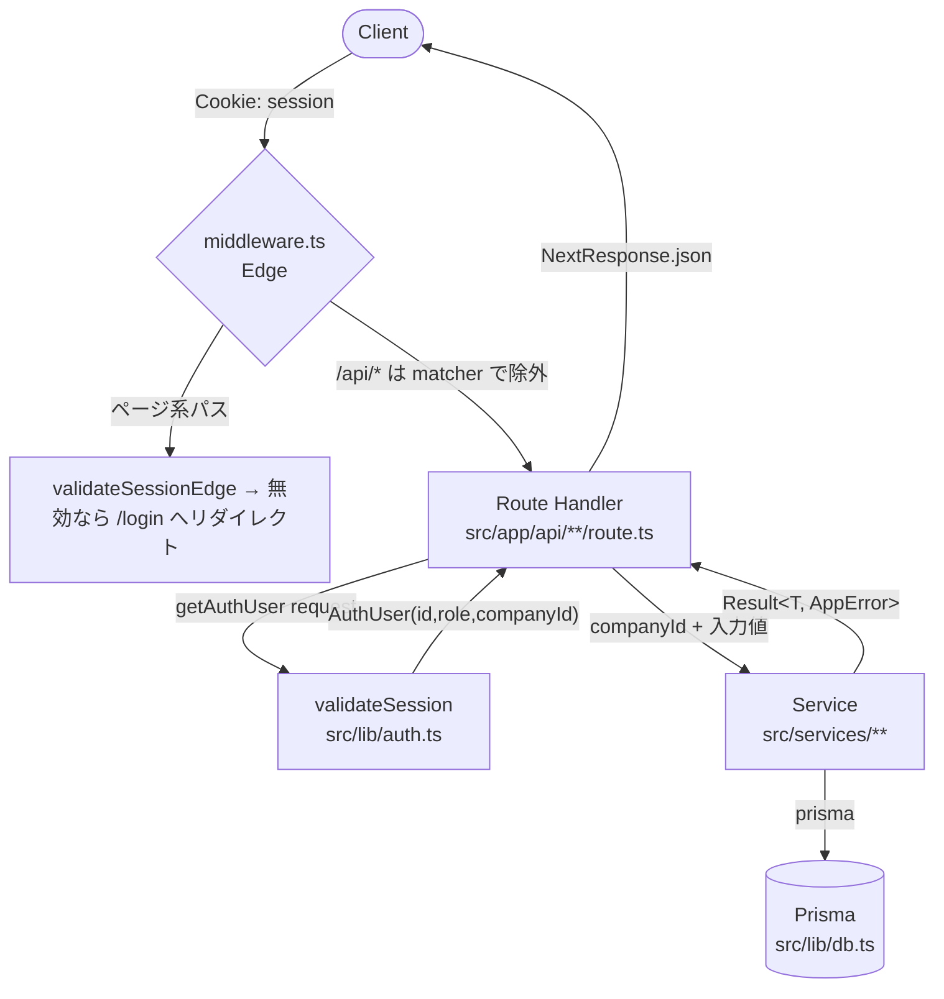

# freee_audit アーキテクチャ概要

> 本書は **非 Class-A（自動編集可能領域）の視点** から、モジュール構成・リクエスト処理フロー・
> コーディング規約をまとめたエントリポイントである。システム全体の要件・非機能要件は
> [`DESIGN.md`](./DESIGN.md)、API 仕様は [`API_DESIGN.md`](./API_DESIGN.md)、スキーマは
> [`DATABASE_DESIGN.md`](./DATABASE_DESIGN.md) を参照のこと。
>
> 用語: **Class-A** = 人間所有・自動変更禁止領域（[§5](#5-class-a-境界自動変更禁止領域) 参照）。
> 自動エージェントは同領域を **参照のみ** 可能とし、編集してはならない。

---

## 1. トップレベルモジュールマップ

Next.js (App Router) + TypeScript の単一リポジトリ。エントリは `src/` 配下の 5 層構造。

| 層 | パス | 役割 |
|----|------|------|
| **App（プレゼン＋ルーティング）** | `src/app/` | App Router ページと API Routes。`[locale]/(authenticated)/...` 配下に保護対象ページ群、`src/app/api/` に 26 リソースグループ / 122 の `route.ts`。i18n ロケールプレフィクスは常時付与（`/ja/...`, `/en/...`）。 |
| **Components（UI）** | `src/components/` | 13 ディレクトリ。`ui/`（shadcn/ui 44 コンポ）、`layout/`（`AppLayout`, `sidebar`, `dock-sidebar`, `bottom-navigation` = **実質的な共有レイヤ**）、`reports/`, `journal-proposal/`, `conversion/`, `valuation/`, `budget/`, `chat/`, `import/`, `export/`, `settings/`, `currency/`, `charts/`。 |
| **Services（ビジネスロジック）** | `src/services/` | 35 サブディレクトリ。ドメインルールの所有者。DB 読み書き・AI 呼び出し・外部API連携を行い、原則 `Result<T, AppError>` を返す（`report/`, `reports/`, `cashflow/`, `budget/`, `board/`, `dd/`, `analytics/`, `analysis/`, `export/`, ... ）。 |
| **Lib（コアライブラリ）** | `src/lib/` | 横断機能。`api/`（認証ヘルパ・レート制限・ルート監査）、`integrations/`（`ai/`, `freee/`, `box/`, `slack/`）、`ai/`（オーケストレータ・ペルソナ・プロンプト・トークナイザ）、`db.ts`（Prisma シングルトン）、`auth.ts`/`auth-edge.ts`、`crypto.ts`、`security/`、`audit/`、`cache/`、`storage/`、`secrets/`、`utils.ts`。 |
| **Types / 支援** | `src/types/`, `src/hooks/`, `src/contexts/`, `src/config/`, `src/i18n/`, `src/jobs/` | `types/result.ts`（Result 型）、`types/index.ts`（ドメイン型）、`hooks/`、`contexts/page-context.tsx`、`jobs/scheduler.ts`（node-cron・5 ジョブ）。 |

> 参考: マイクロサービスとして `python-service/`（FastAPI・財務計算）、`r-service/`（R Plumber・統計）、
> `ocr-server/`（NDLOCR）を併存。これらは Class-A（[§5](#5-class-a-境界自動変更禁止領域)）。

---

## 2. リクエスト処理フロー（Request → Service → DB）



実行ステップ:

1. **Edge ミドルウェア** (`middleware.ts`): i18n ロケータルーティングとページ系パスの認証リダイレクトを行う。
   ただし `config.matcher` が `/api` を除外しており、**API リクエストはミドルウェアでゲートされない**。
   API の認証は次ステップのルートハンドラ内で行う（`x-user-id` 等のヘッダはレスポンスに付与されるものであり、リクエスト転送されないためアクターの取得元にはならない）。
2. **ルートハンドラ** (`src/app/api/**/route.ts`): `getAuthUser(request)`（`@/lib/api/auth-helpers`）で
   `session` Cookie を読み → `validateSession`（`@/lib/auth`、DB 照合）→ `AuthUser { id, role, companyId }`。
   未認証なら `401`。
3. **サービス呼び出し**: 入力（query/body）を解析し、`companyId` 等を渡して `@/services/**` の関数を呼ぶ。
4. **サービス層**: `prisma` シングルトン（`@/lib/db`、`globalThis` キャッシュ付き `PrismaClient`）で
   DB 読み書きを行い、`Result<T, AppError>` を返す。
5. **レスポンス整形**: ハンドラは `result.success` を判定し、失敗時は
   `NextResponse.json({ error: result.error.message }, { status })`、成功時は `NextResponse.json(result.data)`。
   外枠は `try/catch` で `500` にフォールバック。

> 代表実装: `src/app/api/reports/monthly/route.ts` → `src/services/report/monthly-report.ts` → `prisma`（`@/lib/db`）。

---

## 3. コーディング規約（Result 型 + Zod）

### 3.1 Result<T, E> パターン（全ビジネスロジックで必須）

`src/types/result.ts` が提供する成功/失敗の明示的ユニオン型。例外ではなく戻り値でエラーを表現する。

```ts
import {
  type Result, type AppError, ERROR_CODES,
  createAppError, success, failure,
} from '@/types/result'

// 戻り値は必ず Result<T, AppError>
export async function doSomething(input: Input): Promise<Result<Output, AppError>> {
  if (invalid) {
    return failure(createAppError(ERROR_CODES.VALIDATION_ERROR, '入力値が無効です'))
  }
  return success(output)
}
```

主要エクスポート: `success` / `failure` / `isSuccess` / `isFailure`（型ガード） /
`createAppError(code, message, { details?, cause? })` / `tryCatch`・`tryCatchSync`（例外ラップ） /
`ERROR_CODES`（`VALIDATION_ERROR`, `NOT_FOUND`, `UNAUTHORIZED`, `TIMEOUT`, `DATABASE_ERROR`,
`EXTERNAL_SERVICE_ERROR`, `BUSINESS_LOGIC_ERROR`）。

### 3.2 Zod 入力バリデーション（safeParse）

サービス入力は Zod スキーマを定義し `safeParse` で検証する。失敗時は `VALIDATION_ERROR` の `Result` を返す。

```ts
import { z } from 'zod'

export const InputSchema = z.object({
  companyId: z.string(),
  month: z.number().int().min(1).max(12),
})
export type Input = z.infer<typeof InputSchema>

export async function doSomething(input: Input): Promise<Result<Output, AppError>> {
  const parsed = InputSchema.safeParse(input)
  if (!parsed.success) {
    return failure(createAppError(ERROR_CODES.VALIDATION_ERROR, '入力値が無効です', {
      details: { issues: parsed.error.issues },
    }))
  }
  // ... ビジネスロジック・prisma アクセス ...
  return success(output)
}
```

### 3.3 Result → HTTP マッピング（ルートハンドラ）

ルートハンドラは `Result` を HTTP に変換する。コードベース全体で完全に統一されているわけではないが、
推奨対応関係:

| `ERROR_CODES` | 推奨 HTTP status |
|---------------|------------------|
| `VALIDATION_ERROR` | `400` |
| `UNAUTHORIZED` | `401` / `403` |
| `NOT_FOUND` | `404` |
| `EXTERNAL_SERVICE_ERROR` / `TIMEOUT` | `502` / `504` |
| `DATABASE_ERROR` / `BUSINESS_LOGIC_ERROR` | `500` |

```ts
const result = await doSomething({ ...input, companyId })
if (!result.success) {
  return NextResponse.json({ error: result.error.message }, { status: 400 })
}
return NextResponse.json(result.data)
```

> その他の規約（3 引数以上は options object、kebab-case ファイル/PascalCase コンポーネント/camelCase 関数、
> コメント原則なし）は [`CLAUDE.md`](../CLAUDE.md) §7・[`AGENTS.md`](../AGENTS.md) を参照。

---

## 4. 監査ログのシーム

API が監査ログを残す場合は、`prisma.auditLog.create()` を直接呼ばず
`@/lib/route-audit` の `logRouteAudit()`（ブロックチェーン式ハッシュ鎖 `contentHash + previousHash` を維持）
を経由すること。直接 `prisma` を叩くとハッシュ鎖が壊れる。

---

## 5. Class-A 境界（自動変更禁止領域）

以下は **人間所有（read-only）**。自動エージェントは編集せず、参照のみ行うこと。

**データベース**
- `prisma/schema.prisma`, `prisma/migrations/**`

**セキュリティコア**
- `src/lib/auth*`（`auth.ts`, `auth-edge.ts`, `auth/`）, `src/lib/crypto.ts`, `src/lib/security/**`, `src/lib/audit/**`

**ドメインエンジン（services）**
- `src/services/{audit,conversion,valuation,tax,kpi,debt,deferred-accrual,journal-proposal,freee}/**`

**変換ライブラリ + freee 連携**
- `src/lib/conversion/**`, `src/lib/integrations/freee/**`

**保護対象 API Routes**
- `src/app/api/{audit,journals,journal-proposal,valuation,tax,kpi,deferred-accrual,debt,freee,conversion,auth}/**`

**マイクロサービス**
- `python-service/**`, `r-service/**`

> 上記以外の `src/services/**`・`src/lib/api/**`・`src/components/**`・`src/app/**`（ページ・非保護 API）が
> 自動編集可能な主戦場となる。ただし編集可否は本表が優先する（例: `src/lib/conversion/**` は `src/lib/**` でも Class-A）。

---

## 6. 関連ドキュメント

| 目的 | ドキュメント |
|------|--------------|
| システム設計・非機能要件 | [`DESIGN.md`](./DESIGN.md) |
| API 仕様 | [`API_DESIGN.md`](./API_DESIGN.md) |
| DB スキーマ・ER 図 | [`DATABASE_DESIGN.md`](./DATABASE_DESIGN.md) |
| 機能仕様 | [`FEATURES.md`](./FEATURES.md) |
| 開発フロー・CI/CD・テスト | [`DEVELOPMENT.md`](./DEVELOPMENT.md), [`TEST_STRATEGY.md`](./TEST_STRATEGY.md) |
| セキュリティガイド | [`SECURITY.md`](./SECURITY.md) |
| AI エージェント作業規約 | [`CLAUDE.md`](../CLAUDE.md), [`AGENTS.md`](../AGENTS.md) |
