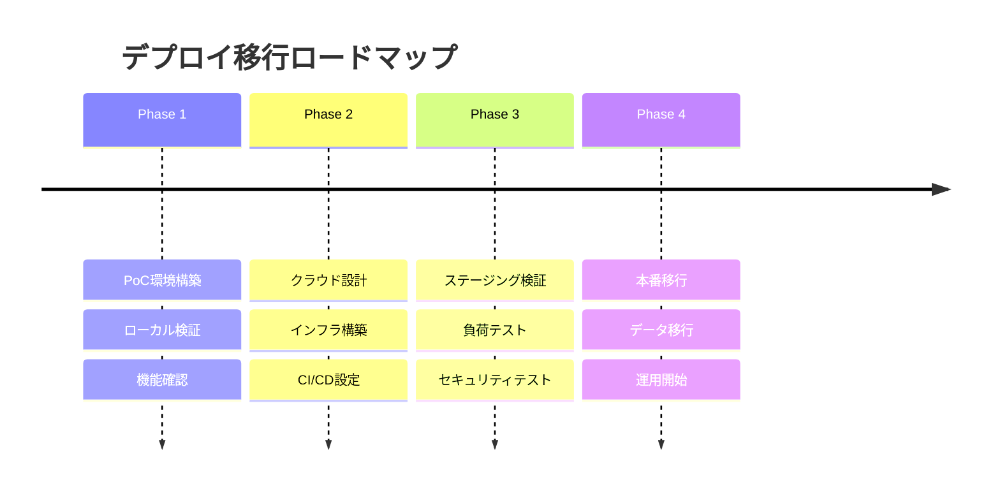
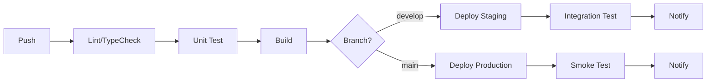
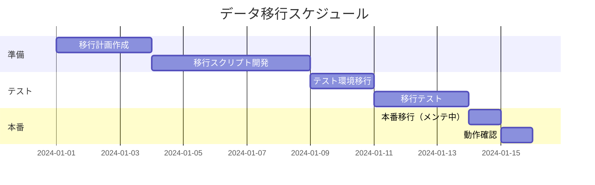
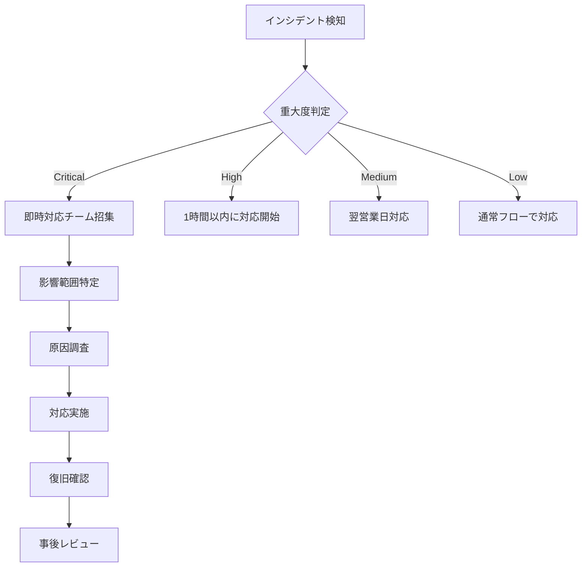

# freee_audit デプロイ・運用ガイド

## 1. デプロイ概要

### 1.1 環境構成

| 環境 | 用途 | インフラ | データベース |
|------|------|---------|-------------|
| Local | 開発 | ローカルPC | SQLite |
| PoC | 検証 | オンプレミス/VM | SQLite |
| Staging | ステージング | クラウド | PostgreSQL |
| Production | 本番 | クラウドサーバーレス | PostgreSQL |

### 1.2 移行ロードマップ



---

## 2. PoC環境

### 2.1 構成

```
┌─────────────────────────────────────┐
│          ローカルPC                  │
│  ┌───────────────────────────────┐  │
│  │     Next.js (pnpm dev)        │  │
│  │     Port: 3000                │  │
│  └───────────────────────────────┘  │
│  ┌───────────────────────────────┐  │
│  │     SQLite (prisma/dev.db)    │  │
│  └───────────────────────────────┘  │
│  ┌───────────────────────────────┐  │
│  │     Local Filesystem          │  │
│  │     ./uploads/                │  │
│  └───────────────────────────────┘  │
└─────────────────────────────────────┘
```

### 2.2 セットアップ

```bash
# 環境変数設定
cp .env.example .env.local

# 依存関係インストール
pnpm install

# データベース初期化
pnpm prisma migrate dev
pnpm prisma db seed

# 開発サーバー起動
pnpm dev

# アクセス
# http://localhost:3000
```

### 2.3 認証設定（ローカル）

```bash
# 初期管理者ユーザー作成（シード実行時自動作成）
# Email: admin@example.com
# Password: admin123

# 本番前にパスワード変更必須
```

---

## 3. 本番環境アーキテクチャ

### 3.1 クラウド構成（AWS例）

```
┌─────────────────────────────────────────────────────────────┐
│                        AWS Cloud                             │
│                                                              │
│  ┌──────────────┐     ┌──────────────────────────────────┐  │
│  │   Route 53   │────▶│         CloudFront (CDN)         │  │
│  └──────────────┘     └──────────────────────────────────┘  │
│                                    │                         │
│  ┌─────────────────────────────────▼──────────────────────┐ │
│  │                    VPC                                  │ │
│  │  ┌──────────────────────────────────────────────────┐  │ │
│  │  │              Application Load Balancer            │  │ │
│  │  └──────────────────────────────────────────────────┘  │ │
│  │                          │                              │ │
│  │  ┌───────────────────────▼─────────────────────────┐   │ │
│  │  │            Lambda (Next.js SSR)                 │   │ │
│  │  │            - Serverless Functions               │   │ │
│  │  │            - API Routes                         │   │ │
│  │  └─────────────────────────────────────────────────┘   │ │
│  │                          │                              │ │
│  │  ┌───────────┐   ┌──────▼──────┐   ┌───────────────┐   │ │
│  │  │    RDS    │   │    ElastiCache   │    S3       │   │ │
│  │  │ PostgreSQL│   │    (Redis)   │   │  (Files)    │   │ │
│  │  └───────────┘   └─────────────┘   └───────────────┘   │ │
│  │         │                                         │     │ │
│  └─────────┼─────────────────────────────────────────┼─────┘ │
│            │                                         │       │
│  ┌─────────▼─────────┐               ┌──────────────▼─────┐ │
│  │   Secrets Manager │               │      KMS           │ │
│  │   (API Keys)      │               │   (Encryption)     │ │
│  └───────────────────┘               └────────────────────┘ │
│                                                              │
└─────────────────────────────────────────────────────────────┘
```

### 3.2 クラウド構成（GCP例）

```
┌─────────────────────────────────────────────────────────────┐
│                        GCP Cloud                             │
│                                                              │
│  ┌──────────────┐     ┌──────────────────────────────────┐  │
│  │  Cloud DNS   │────▶│         Cloud CDN                │  │
│  └──────────────┘     └──────────────────────────────────┘  │
│                                    │                         │
│  ┌─────────────────────────────────▼──────────────────────┐ │
│  │           Cloud Run (Next.js Container)                │ │
│  │           - Auto-scaling                               │ │
│  │           - API Routes                                 │ │
│  └─────────────────────────────────────────────────────────┘ │
│                          │                                   │
│  ┌───────────┐   ┌───────▼───────┐   ┌───────────────────┐  │
│  │ Cloud SQL │   │ Memorystore   │   │   Cloud Storage   │  │
│  │ PostgreSQL│   │   (Redis)     │   │     (Files)       │  │
│  └───────────┘   └───────────────┘   └───────────────────┘  │
│         │                                                   │
│  ┌──────▼────────────┐         ┌────────────────────────┐  │
│  │  Secret Manager   │         │     Cloud KMS          │  │
│  │   (API Keys)      │         │    (Encryption)        │  │
│  └───────────────────┘         └────────────────────────┘  │
│                                                              │
└─────────────────────────────────────────────────────────────┘
```

### 3.3 代替構成（Vercel）

```
┌─────────────────────────────────────────────────────────────┐
│                       Vercel                                 │
│                                                              │
│  ┌─────────────────────────────────────────────────────────┐│
│  │              Vercel Edge Network                        ││
│  │              - Global CDN                               ││
│  │              - Edge Functions                          ││
│  └─────────────────────────────────────────────────────────┘│
│                          │                                   │
│  ┌───────────────────────▼────────────────────────────────┐ │
│  │              Next.js (Serverless)                       │ │
│  │              - API Routes                               │ │
│  │              - ISR/SSR                                  │ │
│  └─────────────────────────────────────────────────────────┘ │
│                          │                                   │
│  ┌───────────────────────┼────────────────────────────────┐ │
│  │     External Services │                                 │ │
│  │  ┌────────────────────▼─────────────────────────────┐  │ │
│  │  │           Vercel Postgres / Neon                 │  │ │
│  │  │           (PostgreSQL Serverless)                │  │ │
│  │  └─────────────────────────────────────────────────┘  │ │
│  │  ┌─────────────────────────────────────────────────┐  │ │
│  │  │           Upstash Redis                         │  │ │
│  │  └─────────────────────────────────────────────────┘  │ │
│  │  ┌─────────────────────────────────────────────────┐  │ │
│  │  │           Box API (File Storage)                │  │ │
│  │  └─────────────────────────────────────────────────┘  │ │
│  └─────────────────────────────────────────────────────────┘ │
└─────────────────────────────────────────────────────────────┘
```

---

## 4. インフラ構築

### 4.1 Terraform構成（AWS例）

```
infrastructure/
├── terraform/
│   ├── modules/
│   │   ├── networking/
│   │   │   ├── vpc.tf
│   │   │   ├── subnets.tf
│   │   │   └── security_groups.tf
│   │   ├── database/
│   │   │   ├── rds.tf
│   │   │   └── parameter_group.tf
│   │   ├── compute/
│   │   │   ├── lambda.tf
│   │   │   └── api_gateway.tf
│   │   └── storage/
│   │       ├── s3.tf
│   │       └── cloudfront.tf
│   ├── environments/
│   │   ├── staging/
│   │   │   ├── main.tf
│   │   │   ├── variables.tf
│   │   │   └── terraform.tfvars
│   │   └── production/
│   │       ├── main.tf
│   │       ├── variables.tf
│   │       └── terraform.tfvars
│   └── shared/
│       ├── backend.tf
│       └── providers.tf
```

### 4.2 主要リソース定義

```hcl
# infrastructure/terraform/modules/database/rds.tf

resource "aws_db_instance" "main" {
  identifier           = "${var.project_name}-${var.environment}"
  engine               = "postgres"
  engine_version       = "15.4"
  instance_class       = var.environment == "production" ? "db.t3.medium" : "db.t3.small"
  allocated_storage    = var.environment == "production" ? 100 : 20
  storage_encrypted    = true
  kms_key_id          = aws_kms_key.database.arn

  db_name  = var.database_name
  username = var.database_username
  password = random_password.database.result

  vpc_security_group_ids = [aws_security_group.database.id]
  db_subnet_group_name   = aws_db_subnet_group.main.name

  backup_retention_period = var.environment == "production" ? 30 : 7
  backup_window          = "16:00-17:00"  # JST 01:00-02:00
  maintenance_window     = "sun:17:00-sun:18:00"  # JST sun 02:00-03:00

  performance_insights_enabled = var.environment == "production"
  monitoring_interval         = var.environment == "production" ? 60 : 0

  deletion_protection = var.environment == "production"
  skip_final_snapshot = var.environment != "production"

  tags = var.tags
}
```

### 4.3 デプロイコマンド

```bash
# Terraform初期化
cd infrastructure/terraform/environments/production
terraform init

# プラン確認
terraform plan

# 適用
terraform apply

# 確認
terraform show
```

---

## 5. CI/CDパイプライン

### 5.1 パイプライン概要



### 5.2 GitHub Actions（本番デプロイ）

```yaml
# .github/workflows/deploy-production.yml
name: Deploy to Production

on:
  push:
    branches: [main]
  workflow_dispatch:
    inputs:
      version:
        description: 'Version to deploy'
        required: false

env:
  AWS_REGION: ap-northeast-1
  ECR_REPOSITORY: freee-audit

jobs:
  build:
    runs-on: ubuntu-latest
    outputs:
      image_tag: ${{ steps.build.outputs.image_tag }}
    steps:
      - uses: actions/checkout@v4

      - name: Configure AWS credentials
        uses: aws-actions/configure-aws-credentials@v4
        with:
          aws-access-key-id: ${{ secrets.AWS_ACCESS_KEY_ID }}
          aws-secret-access-key: ${{ secrets.AWS_SECRET_ACCESS_KEY }}
          aws-region: ${{ env.AWS_REGION }}

      - name: Login to Amazon ECR
        id: login-ecr
        uses: aws-actions/amazon-ecr-login@v2

      - name: Build and push Docker image
        id: build
        run: |
          IMAGE_TAG=${{ github.sha }}
          docker build -t ${{ steps.login-ecr.outputs.registry }}/${{ env.ECR_REPOSITORY }}:$IMAGE_TAG .
          docker push ${{ steps.login-ecr.outputs.registry }}/${{ env.ECR_REPOSITORY }}:$IMAGE_TAG
          echo "image_tag=$IMAGE_TAG" >> $GITHUB_OUTPUT

  deploy:
    needs: build
    runs-on: ubuntu-latest
    environment: production
    steps:
      - uses: actions/checkout@v4

      - name: Configure AWS credentials
        uses: aws-actions/configure-aws-credentials@v4
        with:
          aws-access-key-id: ${{ secrets.AWS_ACCESS_KEY_ID }}
          aws-secret-access-key: ${{ secrets.AWS_SECRET_ACCESS_KEY }}
          aws-region: ${{ env.AWS_REGION }}

      - name: Deploy to Lambda
        run: |
          aws lambda update-function-code \
            --function-name freee-audit \
            --image-uri ${{ steps.login-ecr.outputs.registry }}/${{ env.ECR_REPOSITORY }}:${{ needs.build.outputs.image_tag }}

      - name: Run database migrations
        run: |
          aws lambda invoke \
            --function-name freee-audit-migrate \
            --payload '{}' response.json

      - name: Smoke test
        run: |
          curl -f https://app.example.com/api/health || exit 1

      - name: Notify Slack
        uses: 8398a7/action-slack@v3
        with:
          status: ${{ job.status }}
          fields: repo,message,commit,author
        env:
          SLACK_WEBHOOK_URL: ${{ secrets.SLACK_WEBHOOK }}
        if: always()
```

---

## 6. データ移行

### 6.1 移行計画



### 6.2 移行手順

#### SQLite → PostgreSQL

```bash
# 1. PostgreSQLスキーマ作成
DATABASE_URL="postgresql://..." pnpm prisma migrate deploy

# 2. SQLiteデータエクスポート
sqlite3 prisma/dev.db .dump > dump.sql

# 3. データ変換スクリプト実行
ts-node scripts/migrate-sqlite-to-pg.ts

# 4. データ検証
ts-node scripts/verify-migration.ts
```

#### 移行スクリプト

```typescript
// scripts/migrate-sqlite-to-pg.ts
import { PrismaClient } from '@prisma/client'
import sqlite3 from 'sqlite3'

const sourceDb = new sqlite3.Database('./prisma/dev.db')
const targetDb = new PrismaClient({
  datasourceUrl: process.env.TARGET_DATABASE_URL
})

async function migrateUsers() {
  const users = await queryAll(sourceDb, 'SELECT * FROM users')
  
  for (const user of users) {
    await targetDb.user.create({
      data: {
        id: user.id,
        email: user.email,
        passwordHash: user.password_hash,
        name: user.name,
        role: user.role,
        createdAt: new Date(user.created_at),
        updatedAt: new Date(user.updated_at)
      }
    })
  }
  
  console.log(`Migrated ${users.length} users`)
}

async function main() {
  console.log('Starting migration...')
  
  await migrateUsers()
  await migrateCompanies()
  await migrateJournals()
  await migrateDocuments()
  
  console.log('Migration completed!')
}

main()
  .catch(console.error)
  .finally(() => {
    sourceDb.close()
    targetDb.$disconnect()
  })
```

### 6.3 ロールバック計画

```bash
# 移行前バックアップ
pg_dump -Fc freee_audit > backup_pre_migration.dump

# ロールバック実行
pg_restore --clean -d freee_audit backup_pre_migration.dump

# アプリケーションロールバック
# 前バージョンのコンテナイメージに切り替え
```

---

## 7. 運用

### 7.1 監視

#### メトリクス

| メトリクス | 閾値 | アラート |
|-----------|------|---------|
| API レイテンシ | > 1秒 | Warning |
| API エラー率 | > 1% | Warning |
| API エラー率 | > 5% | Critical |
| DB 接続数 | > 80% | Warning |
| メモリ使用率 | > 85% | Warning |
| CPU使用率 | > 80% | Warning |

#### CloudWatchアラーム（AWS例）

```hcl
resource "aws_cloudwatch_metric_alarm" "api_latency" {
  alarm_name          = "${var.project_name}-api-latency"
  comparison_operator = "GreaterThanThreshold"
  evaluation_periods  = "3"
  metric_name         = "Duration"
  namespace           = "AWS/Lambda"
  period              = "60"
  statistic           = "Average"
  threshold           = "1000"
  alarm_description   = "API latency > 1 second"

  dimensions = {
    FunctionName = aws_lambda_function.main.function_name
  }

  alarm_actions = [aws_sns_topic.alerts.arn]
}
```

### 7.2 ログ管理

```typescript
// 構造化ログ
import { logger } from '@/lib/logger'

logger.info('API request', {
  method: 'GET',
  path: '/api/journals',
  userId: 'user_123',
  duration: 150,
  statusCode: 200
})

logger.error('Database error', {
  error: error.message,
  stack: error.stack,
  query: 'SELECT * FROM journals'
})
```

### 7.3 バックアップ

#### 自動バックアップ

| 種別 | 頻度 | 保持期間 |
|------|------|---------|
| フルバックアップ | 日次 | 30日 |
| 増分バックアップ | 時間 | 7日 |
| PITRログ | 継続 | 7日 |

```bash
# 手動バックアップ
pg_dump -Fc freee_audit > backup_$(date +%Y%m%d).dump

# リストア
pg_restore -d freee_audit backup_20240115.dump

# PITR リカバリ（特定時点）
# PostgreSQL設定でWALアーカイブ有効化済み
```

### 7.4 定期メンテナンス

| タスク | 頻度 | 実行時刻（JST） |
|--------|------|---------------|
| DB バキューム | 週次 | 日曜 03:00 |
| ログローテーション | 日次 | 00:00 |
| 古いセッション削除 | 日次 | 04:00 |
| 監査ログアーカイブ | 月次 | 1日 05:00 |

```sql
-- 古いセッション削除
DELETE FROM sessions WHERE expires_at < NOW() - INTERVAL '7 days';

-- 監査ログアーカイブ（7年以上保持）
-- アーカイブテーブルへ移動後、S3へエクスポート
```

---

## 8. セキュリティ運用

### 8.1 脆弱性スキャン

```yaml
# .github/workflows/security.yml
name: Security Scan

on:
  schedule:
    - cron: '0 0 * * *'  # 毎日実行
  workflow_dispatch:

jobs:
  dependency-check:
    runs-on: ubuntu-latest
    steps:
      - uses: actions/checkout@v4
      - run: pnpm audit --audit-level=high
      - uses: snyk/actions/node@master
        env:
          SNYK_TOKEN: ${{ secrets.SNYK_TOKEN }}

  container-scan:
    runs-on: ubuntu-latest
    steps:
      - uses: actions/checkout@v4
      - name: Build image
        run: docker build -t app .
      - name: Scan image
        uses: aquasecurity/trivy-action@master
        with:
          image-ref: 'app'
          format: 'sarif'
          output: 'trivy-results.sarif'
```

### 8.2 アクセスレビュー

| 項目 | 頻度 | 責任者 |
|------|------|--------|
| ユーザー権限レビュー | 四半期 | 管理者 |
| APIキーローテーション | 半年 | セキュリティ担当 |
| パスワードポリシー確認 | 四半期 | 管理者 |

### 8.3 インシデント対応



---

## 9. スケーリング

### 9.1 オートスケーリング設定

```hcl
# Lambda同時実行数設定
resource "aws_lambda_function" "main" {
  function_name = "freee-audit"
  # ...
  reserved_concurrent_executions = 100
}

# RDS スケーリング
resource "aws_db_instance" "main" {
  # ...
  max_allocated_storage = 1000  # 自動ストレージ拡張
}

# Cloud Run (GCP)
resource "google_cloud_run_service" "main" {
  name     = "freee-audit"
  location = "asia-northeast1"

  template {
    spec {
      containers {
        image = var.image_url
        resources {
          limits = {
            cpu    = "2"
            memory = "2Gi"
          }
        }
      }
    }
    
    metadata {
      annotations = {
        "autoscaling.knative.dev/maxScale" = "10"
        "autoscaling.knative.dev/minScale" = "1"
      }
    }
  }
}
```

### 9.2 パフォーマンス最適化

| 施策 | 効果 |
|------|------|
| CDNキャッシュ | 静的アセット配信高速化 |
| Redisキャッシュ | API レスポンス高速化 |
| DB接続プール | 接続オーバーヘッド削減 |
| クエリ最適化 | DB負荷軽減 |

---

## 10. 障害復旧（DR）

### 10.1 RTO/RPO目標

| 項目 | 目標 |
|------|------|
| RTO（復旧時間目標） | 4時間 |
| RPO（復旧時点目標） | 1時間 |

### 10.2 DR構成

```
┌─────────────────────────────────────────────────────────────┐
│                      Primary Region                          │
│                    (ap-northeast-1)                          │
│  ┌─────────────────────────────────────────────────────────┐│
│  │                 Production Environment                   ││
│  │  - Lambda / Cloud Run                                   ││
│  │  - RDS PostgreSQL (Primary)                             ││
│  │  - S3 / Cloud Storage                                   ││
│  └─────────────────────────────────────────────────────────┘│
└─────────────────────────────────────────────────────────────┘
                          │
                          │ Replication
                          ▼
┌─────────────────────────────────────────────────────────────┐
│                    Secondary Region                          │
│                    (ap-northeast-3)                          │
│  ┌─────────────────────────────────────────────────────────┐│
│  │                 Standby Environment                      ││
│  │  - Lambda / Cloud Run (Cold)                            ││
│  │  - RDS PostgreSQL (Read Replica → Promote)              ││
│  │  - S3 / Cloud Storage (Replicated)                      ││
│  └─────────────────────────────────────────────────────────┘│
└─────────────────────────────────────────────────────────────┘
```

### 10.3 フェイルオーバー手順

```bash
# 1. DNS切り替え
aws route53 change-resource-record-sets \
  --hosted-zone-id $ZONE_ID \
  --change-batch file://failover.json

# 2. RDS昇格
aws rds promote-read-replica \
  --db-instance-identifier freee-audit-replica

# 3. アプリケーション起動
aws lambda update-function-configuration \
  --function-name freee-audit \
  --environment Variables={DATABASE_URL=$SECONDARY_DB_URL}

# 4. 動作確認
curl -f https://app.example.com/api/health
```

---

## 11. 運用チェックリスト

### 11.1 日次

- [ ] アラート確認
- [ ] エラーログ確認
- [ ] バックアップ成功確認

### 11.2 週次

- [ ] パフォーマンス指標レビュー
- [ ] セキュリティアラート確認
- [ ] ディスク容量確認

### 11.3 月次

- [ ] コストレビュー
- [ ] セキュリティパッチ適用
- [ ] 障害レビュー

### 11.4 四半期

- [ ] DR訓練
- [ ] アクセス権限レビュー
- [ ] キャパシティプランニング

---

## 12. 連絡先

| 役割 | 担当 | 連絡先 |
|------|------|--------|
| 開発リード | - | - |
| インフラ担当 | - | - |
| セキュリティ担当 | - | - |
| 運用担当 | - | - |
| 緊急連絡先 | - | - |
