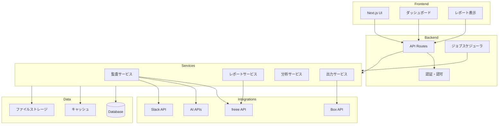
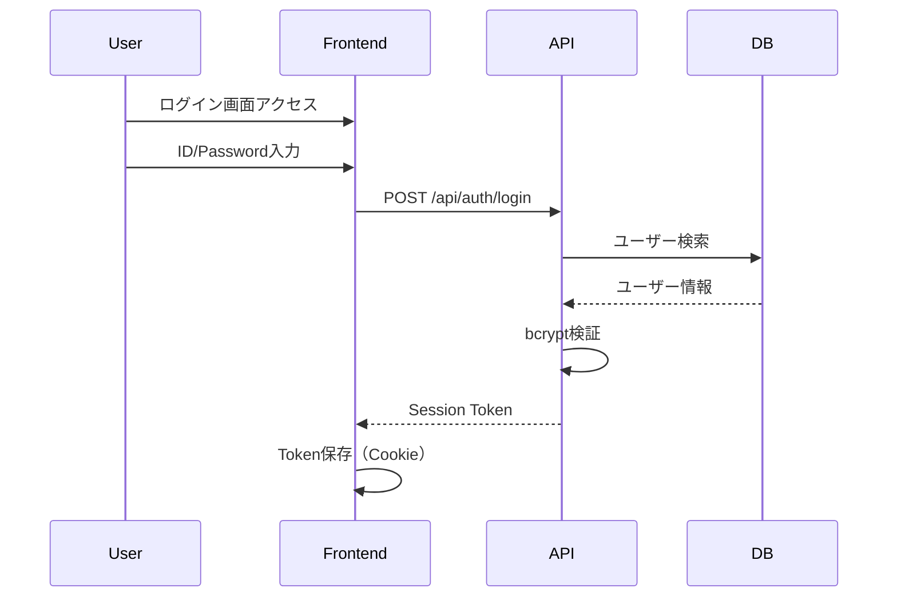
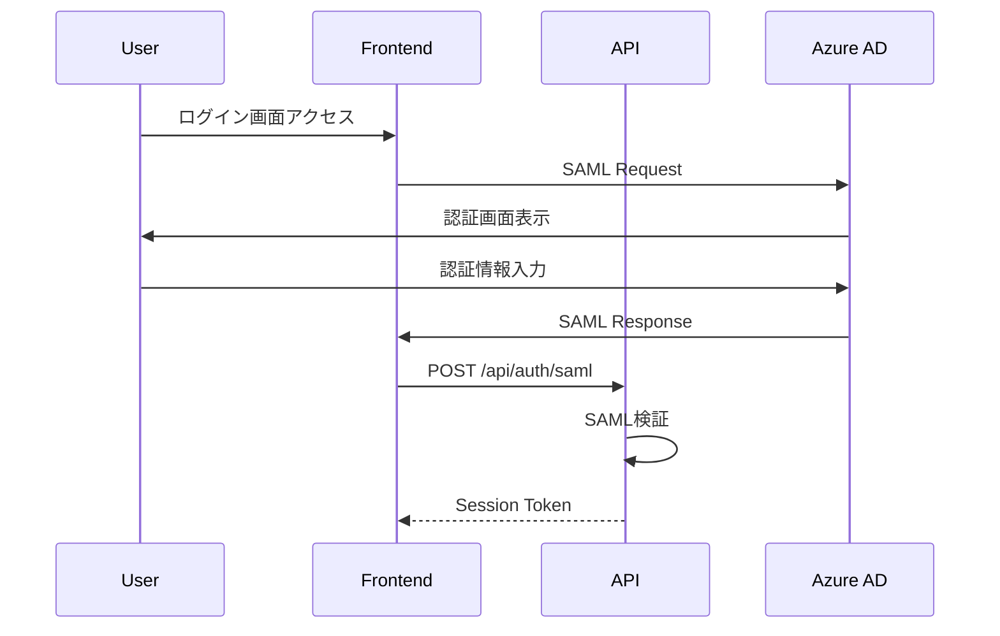

# freee_audit システム設計書

## 1. システム概要

### 1.1 システム名
**freee_audit** - 会計freee仕訳監査・レポートシステム

### 1.2 目的
- 会計freeeの仕訳データをAIで自動監査し、整合性を検証
- 月次決算資料（BS/PL/CF/資金繰り表）の自動作成
- 経営指標の可視化と予実管理
- 投資家向けレポートポータルの提供

### 1.3 運用形態

| フェーズ | 環境 | データベース | 認証 | ストレージ |
|---------|------|-------------|------|-----------|
| PoC | ローカル | SQLite | Local ID/Pass | Local filesystem |
| 本番 | クラウドサーバーレス | PostgreSQL | Azure AD SAML | Box API |

### 1.4 想定データ量
- 仕訳データ: 〜500件/月
- 証憑ファイル: 〜500件/月
- 保持期間: 7年（法的要件）

---

## 2. アーキテクチャ

### 2.1 システムアーキテクチャ図



### 2.2 レイヤー構成

```
┌─────────────────────────────────────────┐
│           Presentation Layer            │
│  (Next.js Pages, Components, Charts)    │
├─────────────────────────────────────────┤
│           Application Layer             │
│     (API Routes, Services, Jobs)        │
├─────────────────────────────────────────┤
│           Domain Layer                  │
│  (Business Logic, Validation Rules)     │
├─────────────────────────────────────────┤
│           Infrastructure Layer          │
│  (DB, External APIs, File Storage)      │
└─────────────────────────────────────────┘
```

---

## 3. 技術スタック

### 3.1 フロントエンド

| 技術 | バージョン | 用途 |
|------|-----------|------|
| Next.js | 14.x | フルスタックフレームワーク |
| TypeScript | 5.x | 型安全な開発 |
| Tailwind CSS | 3.x | スタイリング |
| Recharts | 2.x | グラフ描画 |
| next-intl | 3.x | 国際化 |

### 3.2 バックエンド

| 技術 | バージョン | 用途 |
|------|-----------|------|
| Next.js API Routes | 14.x | RESTful API |
| Prisma | 5.x | ORM |
| Node.js | 20.x LTS | ランタイム |

### 3.3 データベース

| 環境 | 技術 | 用途 |
|------|------|------|
| PoC | SQLite | ローカル開発 |
| 本番 | PostgreSQL | クラウド本番 |

### 3.4 外部API

| API | 用途 |
|-----|------|
| freee API | 会計データ取得 |
| OpenAI API | AI証憑分析 |
| Gemini API | AI証憑分析（代替） |
| Claude API | AI証憑分析（代替） |
| Slack API | 通知送信 |
| Box API | ファイルストレージ |

### 3.5 セキュリティ

| 項目 | PoC | 本番 |
|------|-----|------|
| 認証 | bcrypt | Azure AD SAML |
| 暗号化 | DPAPI | Cloud KMS |
| APIキー管理 | DPAPI | Cloud KMS |
| 通信暗号化 | TLS 1.3 | TLS 1.3 |

---

## 4. ディレクトリ構成

```
freee_audit/
├── src/
│   ├── app/
│   │   └── [locale]/              # 国際化ルート
│   │       ├── layout.tsx
│   │       ├── page.tsx
│   │       ├── dashboard/
│   │       ├── reports/
│   │       ├── budgets/
│   │       ├── settings/
│   │       └── api/               # API Routes
│   │           ├── auth/
│   │           ├── journals/
│   │           ├── reports/
│   │           ├── budgets/
│   │           └── settings/
│   │
│   ├── components/
│   │   ├── ui/                    # 基本UIコンポーネント
│   │   │   ├── Button.tsx
│   │   │   ├── Input.tsx
│   │   │   ├── Table.tsx
│   │   │   └── Modal.tsx
│   │   ├── charts/                # グラフコンポーネント
│   │   │   ├── LineChart.tsx
│   │   │   ├── BarChart.tsx
│   │   │   └── PieChart.tsx
│   │   ├── reports/               # レポートコンポーネント
│   │   │   ├── BalanceSheet.tsx
│   │   │   ├── ProfitLoss.tsx
│   │   │   └── CashFlow.tsx
│   │   └── layout/                # レイアウトコンポーネント
│   │       ├── Header.tsx
│   │       ├── Sidebar.tsx
│   │       └── Footer.tsx
│   │
│   ├── lib/
│   │   ├── db.ts                  # Prisma クライアント
│   │   ├── auth.ts                # 認証ロジック
│   │   ├── crypto.ts              # 暗号化ユーティリティ
│   │   ├── audit.ts               # 監査ログ
│   │   └── i18n.ts                # 国際化設定
│   │
│   ├── services/
│   │   ├── audit/                 # 仕訳監査
│   │   │   ├── index.ts
│   │   │   ├── analyzer.ts
│   │   │   └── validator.ts
│   │   ├── report/                # レポート作成
│   │   │   ├── balance-sheet.ts
│   │   │   ├── profit-loss.ts
│   │   │   └── cash-flow.ts
│   │   ├── budget/                # 予算管理
│   │   ├── cashflow/              # 資金繰り
│   │   ├── export/                # 出力機能
│   │   │   ├── pdf.ts
│   │   │   ├── powerpoint.ts
│   │   │   └── excel.ts
│   │   ├── analytics/             # 経営指標
│   │   └── currency/              # 為替換算
│   │
│   ├── integrations/
│   │   ├── freee/                 # freee API
│   │   │   ├── client.ts
│   │   │   ├── auth.ts
│   │   │   ├── journals.ts
│   │   │   └── reports.ts
│   │   ├── slack/                 # Slack API
│   │   ├── box/                   # Box API
│   │   └── ai/                    # AI APIs
│   │       ├── openai.ts
│   │       ├── gemini.ts
│   │       └── claude.ts
│   │
│   ├── jobs/
│   │   ├── scheduler.ts           # ジョブスケジューラ
│   │   ├── journal-sync.ts        # 仕訳同期ジョブ
│   │   └── audit-job.ts           # 監査ジョブ
│   │
│   └── types/
│       ├── index.ts
│       ├── journal.ts
│       ├── report.ts
│       └── user.ts
│
├── prisma/
│   ├── schema.prisma
│   ├── migrations/
│   └── seeds/
│
├── tests/
│   ├── unit/
│   ├── integration/
│   └── e2e/
│
├── messages/                      # i18n翻訳ファイル
│   ├── en.json
│   └── ja.json
│
├── docs/
│   ├── DESIGN.md
│   ├── API_DESIGN.md
│   ├── DATABASE_DESIGN.md
│   ├── FEATURES.md
│   ├── DEVELOPMENT.md
│   └── DEPLOYMENT.md
│
├── .github/
│   └── workflows/
│       ├── ci.yml
│       └── deploy.yml
│
├── infrastructure/
│   ├── terraform/
│   └── docker/
│
├── .env.example
├── .env.local
├── package.json
├── tsconfig.json
├── tailwind.config.ts
├── next.config.js
└── README.md
```

---

## 5. セキュリティ設計

### 5.1 認証フロー

#### PoC環境（ローカル認証）



#### 本番環境（Azure AD SAML）



### 5.2 認可モデル

#### ロール定義

| ロール | 権限 |
|--------|------|
| Admin | 全機能アクセス、設定変更、ユーザー管理 |
| Accountant | 監査実行、レポート作成、予算入力 |
| Viewer | レポート閲覧のみ |
| Investor | 投資家ポータル閲覧のみ（read-only） |

#### アクセス制御マトリックス

| リソース | Admin | Accountant | Viewer | Investor |
|---------|-------|------------|--------|----------|
| ダッシュボード | ✅ | ✅ | ✅ | ❌ |
| 仕訳監査 | ✅ | ✅ | 読取 | ❌ |
| レポート | ✅ | ✅ | ✅ | ✅ |
| 予算管理 | ✅ | ✅ | 読取 | ❌ |
| 設定 | ✅ | ❌ | ❌ | ❌ |
| ユーザー管理 | ✅ | ❌ | ❌ | ❌ |

### 5.3 データ暗号化

#### 暗号化方式

| データ種別 | 暗号化方式 | 鍵管理 |
|-----------|-----------|--------|
| APIキー | AES-256-GCM | DPAPI / Cloud KMS |
| パスワード | bcrypt (cost=12) | - |
| 通信 | TLS 1.3 | - |
| 保存データ | AES-256-GCM | Cloud KMS |

#### 暗号化実装

```typescript
// 暗号化ユーティリティのインターフェース
interface CryptoService {
  encrypt(plaintext: string): Promise<string>
  decrypt(ciphertext: string): Promise<string>
}

// PoC: DPAPI使用
class DPAPICryptoService implements CryptoService {
  // Windows DPAPIを使用
}

// 本番: Cloud KMS使用
class KMSCryptoService implements CryptoService {
  // Cloud KMS APIを使用
}
```

### 5.4 監査ログ

#### ログ対象

- 全API呼び出し
- ユーザー操作（ログイン、設定変更等）
- データアクセス（閲覧、更新、削除）
- 外部API連携

#### ログフォーマット

```typescript
interface AuditLog {
  id: string
  timestamp: Date
  userId: string
  action: string
  resource: string
  resourceId?: string
  ipAddress: string
  userAgent: string
  details: Record<string, unknown>
  result: 'success' | 'failure'
}
```

---

## 6. 非機能要件

### 6.1 パフォーマンス

| 項目 | 要件 |
|------|------|
| ページ読み込み | 3秒以内 |
| API応答時間 | 1秒以内（平均） |
| 同時接続数 | 10ユーザー（PoC）/ 100ユーザー（本番） |

### 6.2 可用性

| 項目 | 要件 |
|------|------|
| 稼働率 | 99%（PoC）/ 99.9%（本番） |
| バックアップ | 日次 + PITR（本番） |
| 障害復旧 | RPO: 1時間、RTO: 4時間 |

### 6.3 拡張性

- サーバーレスアーキテクチャによる水平スケーリング
- データベース接続プール管理
- キャッシュ戦略（Redis導入検討）

---

## 7. 開発フェーズ

### Phase 1: 基盤構築（2週間）
- プロジェクトセットアップ
- 認証・認可基盤
- freee API連携
- データベース設計・実装

### Phase 2: 仕訳監査（2週間）
- 仕訳データ同期
- AI証憑分析機能
- Slack通知機能
- 監査ログ機能

### Phase 3: レポート作成（2週間）
- BS/PL取得・表示
- CF計算書（間接法）
- 資金繰り表
- ダッシュボード

### Phase 4: 経営指標（1週間）
- Runway/Burn Rate計算
- 予実管理表
- KPI ダッシュボード

### Phase 5: 出力機能（1週間）
- PDF出力
- PowerPoint出力
- Excel/CSV出力

### Phase 6: 多言語・為替（1週間）
- 英語/日本語対応
- 為替換算機能
- デュアルカレンシー表示

### Phase 7: セキュリティ強化（1週間）
- セキュリティテスト
- 脆弱性対策
- 監査ログ強化

### Phase 8: クラウド移行準備（1週間）
- CI/CD構築
- 本番環境構築
- 移行テスト

### Phase 9: 本番稼働
- 投資家ポータル
- Box連携
- 運用開始

---

## 8. 用語集

| 用語 | 説明 |
|------|------|
| BS | 貸借対照表（Balance Sheet） |
| PL | 損益計算書（Profit and Loss） |
| CF | キャッシュフロー計算書 |
| TTM | Time to Market（月末為替レート） |
| PITR | Point-in-Time Recovery |
| DPAPI | Data Protection API（Windows暗号化API） |
| KMS | Key Management Service |
| Runway | 資金繰りが維持できる期間 |
| Burn Rate | 月次の資金消費率 |
