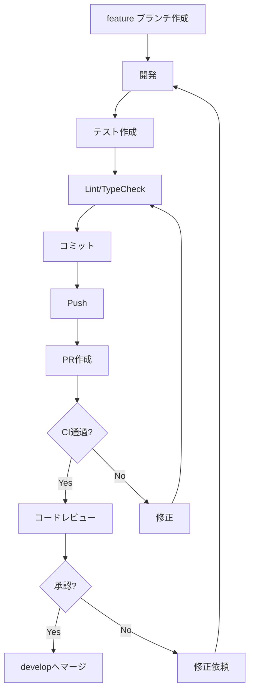

# freee_audit 開発ガイド

## 1. 開発環境セットアップ

### 1.1 前提条件

| 項目 | バージョン | 備考 |
|------|-----------|------|
| Node.js | 20.x LTS | 推奨: 20.11以上 |
| pnpm | 8.x | パッケージマネージャー |
| Git | 2.x | バージョン管理 |
| VSCode | 最新 | 推奨エディタ |

### 1.2 セットアップ手順

```bash
# リポジトリクローン
git clone https://github.com/company/freee_audit.git
cd freee_audit

# 依存関係インストール
pnpm install

# 環境変数設定
cp .env.example .env.local

# データベース初期化
pnpm prisma generate
pnpm prisma migrate dev
pnpm prisma db seed

# 開発サーバー起動
pnpm dev
```

### 1.3 環境変数

```bash
# .env.local

# Database
DATABASE_URL="file:./dev.db"

# Authentication
NEXTAUTH_SECRET="your-secret-key"
NEXTAUTH_URL="http://localhost:3000"

# freee API
FREEE_CLIENT_ID="your-client-id"
FREEE_CLIENT_SECRET="your-client-secret"
FREEE_REDIRECT_URI="http://localhost:3000/api/auth/freee/callback"

# AI APIs (いずれか一つ以上)
OPENAI_API_KEY="sk-..."
GEMINI_API_KEY="..."
ANTHROPIC_API_KEY="sk-ant-..."

# Slack
SLACK_BOT_TOKEN="xoxb-..."
SLACK_CHANNEL_ID="C..."

# Box (本番のみ)
BOX_CLIENT_ID="..."
BOX_CLIENT_SECRET="..."
BOX_ENTERPRISE_ID="..."

# Encryption
ENCRYPTION_KEY="32-byte-hex-string"
```

### 1.4 VSCode推奨拡張機能

```json
// .vscode/extensions.json
{
  "recommendations": [
    "dbaeumer.vscode-eslint",
    "esbenp.prettier-vscode",
    "bradlc.vscode-tailwindcss",
    "Prisma.prisma",
    "ms-playwright.playwright",
    "YoavBls.pretty-ts-errors"
  ]
}
```

---

## 2. プロジェクト構造

### 2.1 ディレクトリ構成

```
freee_audit/
├── src/
│   ├── app/                    # Next.js App Router
│   │   ├── [locale]/           # 国際化ルート
│   │   ├── api/                # API Routes
│   │   ├── layout.tsx
│   │   └── page.tsx
│   ├── components/             # Reactコンポーネント
│   ├── lib/                    # ユーティリティ
│   ├── services/               # ビジネスロジック
│   ├── integrations/           # 外部API連携
│   ├── jobs/                   # 定期ジョブ
│   └── types/                  # TypeScript型定義
├── prisma/                     # データベース
├── tests/                      # テスト
├── messages/                   # i18n翻訳
├── public/                     # 静的ファイル
└── docs/                       # ドキュメント
```

### 2.2 命名規則

| 種別 | 規則 | 例 |
|------|------|-----|
| ファイル名 | kebab-case | `audit-service.ts` |
| コンポーネント | PascalCase | `BalanceSheet.tsx` |
| 関数 | camelCase | `calculateRunway()` |
| 定数 | UPPER_SNAKE_CASE | `MAX_RETRY_COUNT` |
| 型/インターフェース | PascalCase | `JournalEntry` |

### 2.3 コード規約

```typescript
// インポート順序
import { useState } from 'react'           // 1. 外部ライブラリ
import { Button } from '@/components/ui'   // 2. 内部コンポーネント
import { formatDate } from '@/lib/utils'   // 3. ユーティリティ
import type { Journal } from '@/types'     // 4. 型定義

// 関数定義
export async function getJournals(
  companyId: string,
  params: JournalParams
): Promise<Journal[]> {
  // 実装
}

// コンポーネント定義
interface BalanceSheetProps {
  data: BalanceSheetData
  currency: 'JPY' | 'USD'
}

export function BalanceSheet({ data, currency }: BalanceSheetProps) {
  return (
    // JSX
  )
}
```

---

## 3. 開発ワークフロー

### 3.1 ブランチ戦略

```
main
├── develop
│   ├── feature/audit-module
│   ├── feature/report-export
│   └── bugfix/journal-sync
└── hotfix/critical-fix
```

| ブランチ | 用途 |
|---------|------|
| main | 本番環境 |
| develop | 開発統合 |
| feature/* | 新機能開発 |
| bugfix/* | バグ修正 |
| hotfix/* | 緊急修正 |

### 3.2 コミット規約

```bash
# フォーマット
<type>(<scope>): <subject>

# 例
feat(audit): add AI document analysis
fix(journal): correct sync timing
docs(api): update endpoint documentation
test(report): add unit tests for CF calculation
refactor(crypto): simplify encryption logic
```

| Type | 説明 |
|------|------|
| feat | 新機能 |
| fix | バグ修正 |
| docs | ドキュメント |
| test | テスト |
| refactor | リファクタリング |
| chore | その他 |

### 3.3 プルリクエストフロー



---

## 4. CI/CD

### 4.1 GitHub Actions

#### CIワークフロー

```yaml
# .github/workflows/ci.yml
name: CI

on:
  push:
    branches: [main, develop]
  pull_request:
    branches: [main, develop]

jobs:
  lint:
    runs-on: ubuntu-latest
    steps:
      - uses: actions/checkout@v4
      - uses: pnpm/action-setup@v2
        with:
          version: 8
      - uses: actions/setup-node@v4
        with:
          node-version: '20'
          cache: 'pnpm'
      - run: pnpm install --frozen-lockfile
      - run: pnpm lint

  typecheck:
    runs-on: ubuntu-latest
    steps:
      - uses: actions/checkout@v4
      - uses: pnpm/action-setup@v2
        with:
          version: 8
      - uses: actions/setup-node@v4
        with:
          node-version: '20'
          cache: 'pnpm'
      - run: pnpm install --frozen-lockfile
      - run: pnpm typecheck

  test:
    runs-on: ubuntu-latest
    steps:
      - uses: actions/checkout@v4
      - uses: pnpm/action-setup@v2
        with:
          version: 8
      - uses: actions/setup-node@v4
        with:
          node-version: '20'
          cache: 'pnpm'
      - run: pnpm install --frozen-lockfile
      - run: pnpm prisma generate
      - run: pnpm test:coverage
      - uses: codecov/codecov-action@v3
        with:
          files: ./coverage/lcov.info

  e2e:
    runs-on: ubuntu-latest
    steps:
      - uses: actions/checkout@v4
      - uses: pnpm/action-setup@v2
        with:
          version: 8
      - uses: actions/setup-node@v4
        with:
          node-version: '20'
          cache: 'pnpm'
      - run: pnpm install --frozen-lockfile
      - run: pnpm playwright install --with-deps
      - run: pnpm build
      - run: pnpm e2e
      - uses: actions/upload-artifact@v4
        if: failure()
        with:
          name: playwright-report
          path: playwright-report/
```

#### デプロイワークフロー

```yaml
# .github/workflows/deploy.yml
name: Deploy

on:
  push:
    branches: [main]
  workflow_dispatch:

jobs:
  deploy:
    runs-on: ubuntu-latest
    environment: production
    steps:
      - uses: actions/checkout@v4
      - uses: pnpm/action-setup@v2
        with:
          version: 8
      - uses: actions/setup-node@v4
        with:
          node-version: '20'
          cache: 'pnpm'
      - run: pnpm install --frozen-lockfile
      - run: pnpm build
      - name: Deploy to Cloud
        run: |
          # クラウドプロバイダーへのデプロイコマンド
```

### 4.2 必須チェック

PRマージ前に以下が必須:

- ✅ Lint通過
- ✅ TypeScript型チェック通過
- ✅ ユニットテスト通過
- ✅ カバレッジ 80%以上
- ✅ コードレビュー承認

---

## 5. テスト戦略

### 5.1 テストピラミッド

```
        ┌───────┐
        │  E2E  │    (Playwright)
        ├───────┤
        │統合テスト│   (Jest)
        ├───────┤
        │ユニット  │   (Jest + Vitest)
        └───────┘
```

### 5.2 テスト構成

```
tests/
├── unit/                    # ユニットテスト
│   ├── services/
│   │   ├── audit.test.ts
│   │   ├── report.test.ts
│   │   └── currency.test.ts
│   └── lib/
│       ├── crypto.test.ts
│       └── utils.test.ts
│
├── integration/             # 統合テスト
│   ├── api/
│   │   ├── journals.test.ts
│   │   └── reports.test.ts
│   └── integrations/
│       └── freee.test.ts
│
└── e2e/                     # E2Eテスト
    ├── auth.spec.ts
    ├── dashboard.spec.ts
    └── reports.spec.ts
```

### 5.3 ユニットテスト

```typescript
// tests/unit/services/report.test.ts
import { describe, it, expect } from 'vitest'
import { calculateOperatingCF } from '@/services/report/cash-flow'

describe('Cash Flow Calculation', () => {
  it('should calculate operating cash flow correctly', () => {
    const pl = {
      netIncome: 1000000,
      depreciation: 200000
    }
    const bs = {
      current: { accountsReceivable: 300000, inventory: 100000, accountsPayable: 200000 },
      previous: { accountsReceivable: 250000, inventory: 80000, accountsPayable: 180000 }
    }

    const result = calculateOperatingCF(pl, bs)

    // 当期純利益 + 減価償却 - 売掛金増加 - 棚卸資産増加 + 買掛金増加
    // = 1,000,000 + 200,000 - 50,000 - 20,000 + 20,000 = 1,150,000
    expect(result).toBe(1150000)
  })
})
```

### 5.4 統合テスト

```typescript
// tests/integration/api/journals.test.ts
import { describe, it, expect, beforeAll, afterAll } from 'vitest'
import { POST } from '@/app/api/journals/sync/route'
import { prisma } from '@/lib/db'

describe('POST /api/journals/sync', () => {
  beforeAll(async () => {
    // テストデータ準備
    await prisma.company.create({
      data: { id: 'test-company', name: 'Test Company' }
    })
  })

  afterAll(async () => {
    // クリーンアップ
    await prisma.company.deleteMany()
  })

  it('should sync journals from freee', async () => {
    const request = new Request('http://localhost/api/journals/sync', {
      method: 'POST',
      headers: { 'Content-Type': 'application/json' },
      body: JSON.stringify({ companyId: 'test-company' })
    })

    const response = await POST(request)
    const data = await response.json()

    expect(response.status).toBe(200)
    expect(data.syncedCount).toBeGreaterThan(0)
  })
})
```

### 5.5 E2Eテスト

```typescript
// tests/e2e/dashboard.spec.ts
import { test, expect } from '@playwright/test'

test.describe('Dashboard', () => {
  test.beforeEach(async ({ page }) => {
    await page.goto('/login')
    await page.fill('[name="email"]', 'test@example.com')
    await page.fill('[name="password"]', 'password123')
    await page.click('button[type="submit"]')
    await page.waitForURL('/dashboard')
  })

  test('should display KPI widgets', async ({ page }) => {
    await expect(page.locator('[data-testid="revenue-widget"]')).toBeVisible()
    await expect(page.locator('[data-testid="profit-widget"]')).toBeVisible()
    await expect(page.locator('[data-testid="cash-widget"]')).toBeVisible()
  })

  test('should navigate to reports page', async ({ page }) => {
    await page.click('text=レポート')
    await expect(page).toHaveURL(/\/reports/)
  })
})
```

### 5.6 テスト実行コマンド

```bash
# ユニットテスト
pnpm test

# ユニットテスト（ウォッチモード）
pnpm test:watch

# カバレッジ付きテスト
pnpm test:coverage

# 統合テスト
pnpm test:integration

# E2Eテスト
pnpm e2e

# E2Eテスト（UIモード）
pnpm e2e:ui

# 全テスト実行
pnpm test:all
```

### 5.7 モック戦略

```typescript
// tests/__mocks__/freee.ts
export const mockFreeeClient = {
  getJournals: vi.fn().mockResolvedValue([
    { id: '1', entryDate: '2024-01-15', amount: 10000 }
  ]),
  getDocuments: vi.fn().mockResolvedValue([
    { id: '1', fileName: 'receipt.pdf' }
  ])
}

// テストでの使用
vi.mock('@/integrations/freee', () => ({
  FreeeClient: vi.fn(() => mockFreeeClient)
}))
```

---

## 6. デバッグ

### 6.1 ログ出力

```typescript
// 開発環境のみログ出力
if (process.env.NODE_ENV === 'development') {
  console.log('[AuditService]', { journalId, status })
}

// 構造化ログ（本番用）
import { logger } from '@/lib/logger'

logger.info('Journal synced', {
  journalId,
  companyId,
  syncedAt: new Date()
})
```

### 6.2 VSCodeデバッグ設定

```json
// .vscode/launch.json
{
  "version": "0.2.0",
  "configurations": [
    {
      "name": "Next.js: debug full stack",
      "type": "node-terminal",
      "request": "launch",
      "command": "pnpm dev"
    },
    {
      "name": "Jest: debug current test",
      "type": "node",
      "request": "launch",
      "runtimeExecutable": "pnpm",
      "runtimeArgs": ["test", "--run", "--inspect"],
      "console": "integratedTerminal"
    }
  ]
}
```

---

## 7. リリース手順

### 7.1 リリースチェックリスト

```markdown
## リリース前チェック

### コード品質
- [ ] Lint エラーなし
- [ ] TypeScript エラーなし
- [ ] 全テスト通過
- [ ] カバレッジ 80%以上

### 機能確認
- [ ] 主要機能の動作確認
- [ ] 新機能の受け入れテスト
- [ ] 回帰テスト実施

### セキュリティ
- [ ] 依存パッケージ脆弱性チェック
- [ ] 機密情報の漏洩なし
- [ ] 認証・認可の動作確認

### ドキュメント
- [ ] CHANGELOG 更新
- [ ] README 更新（必要時）
- [ ] API ドキュメント更新（必要時）
```

### 7.2 バージョニング

セマンティックバージョニング採用

```
MAJOR.MINOR.PATCH

例:
1.0.0 → 初回リリース
1.1.0 → 機能追加
1.1.1 → バグ修正
2.0.0 → 破壊的変更
```

### 7.3 CHANGELOG

```markdown
# Changelog

## [1.2.0] - 2024-01-15

### Added
- 為替換算機能を追加
- 英語対応を追加

### Changed
- ダッシュボードのデザインを改善

### Fixed
- 仕訳同期のタイムゾーン問題を修正

## [1.1.0] - 2024-01-01

### Added
- PowerPoint出力機能
- 予算CSVインポート機能
```

---

## 8. トラブルシューティング

### 8.1 よくある問題

#### データベース接続エラー

```bash
# Prismaクライアント再生成
pnpm prisma generate

# マイグレーションリセット
pnpm prisma migrate reset
```

#### freee API認証エラー

```bash
# トークン再取得
# 設定画面 → freee連携 → 再連携
```

#### テストが失敗する

```bash
# テストキャッシュクリア
pnpm test --clearCache

# E2Eテストのブラウザ再インストール
pnpm playwright install --with-deps
```

### 8.2 ログ確認

```bash
# 開発サーバーログ
pnpm dev

# 本番ビルドログ
pnpm build

# テストログ
pnpm test --verbose
```

---

## 9. 参考リソース

### 9.1 公式ドキュメント

- [Next.js Documentation](https://nextjs.org/docs)
- [Prisma Documentation](https://www.prisma.io/docs)
- [freee API Documentation](https://developer.freee.co.jp/)
- [OpenAI API Documentation](https://platform.openai.com/docs)

### 9.2 内部ドキュメント

- [DESIGN.md](./DESIGN.md) - システム設計書
- [API_DESIGN.md](./API_DESIGN.md) - API設計書
- [DATABASE_DESIGN.md](./DATABASE_DESIGN.md) - データベース設計書
- [FEATURES.md](./FEATURES.md) - 機能仕様書
- [DEPLOYMENT.md](./DEPLOYMENT.md) - デプロイガイド
