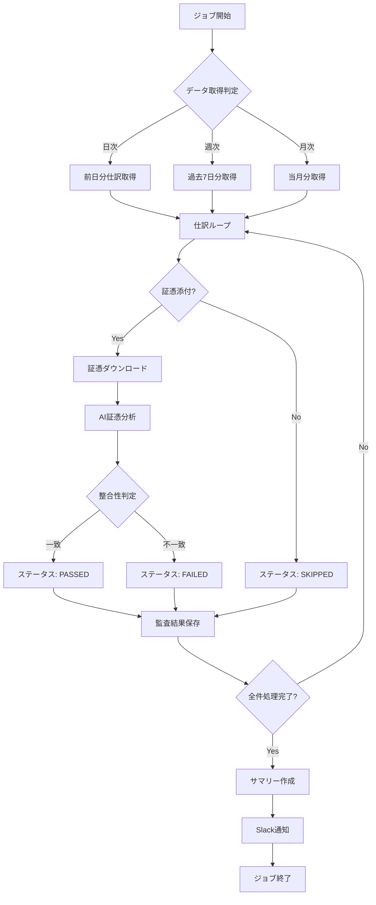
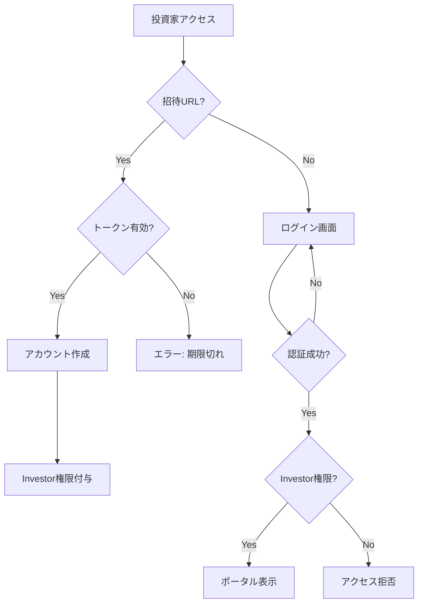

# freee_audit 機能仕様書

## 1. 概要

本ドキュメントは、freee_auditシステムの各機能モジュールの詳細仕様を定義します。

---

## 2. 仕訳監査モジュール

### 2.1 機能概要

会計freeeの仕訳データをAIで自動分析し、証憑との整合性を検証する機能。

### 2.2 処理フロー



### 2.3 定期実行スケジュール

| 種別 | 実行時刻（JST） | 対象データ |
|------|---------------|-----------|
| 日次 | 毎日 02:00 | 前日分仕訳 |
| 週次 | 毎月曜 02:00 | 過去7日分 |
| 月次 | 毎月1日 02:00 | 前月分全仕訳 |

### 2.4 AI証憑分析

#### 分析項目

| 項目 | 検証内容 | 重大度 |
|------|---------|--------|
| 日付 | 証憑の日付と仕訳日付の一致 | Error |
| 勘定科目 | 証憑内容と勘定科目の妥当性 | Warning |
| 金額 | 証憑金額と仕訳金額の一致 | Error |
| 消費税 | 税率・税額の整合性 | Error |
| 摘要 | 証憑内容と摘要の整合性 | Info |

#### 信頼度スコア

```
confidence = 1 - (不一致項目数 / 検証項目数)
```

| スコア | 判定 |
|--------|------|
| 0.9 - 1.0 | PASSED（高信頼） |
| 0.7 - 0.9 | PASSED（中信頼） |
| 0.5 - 0.7 | FAILED（要確認） |
| 0.0 - 0.5 | FAILED（重大不一致） |

### 2.5 Slack通知フォーマット

```
✅ 仕訳監査結果 2024/01/15

総件数: 45件
合格: 42件
要確認: 3件

【要確認項目】
• 仕訳#1234: 金額不一致
  証憑: 11,000円 / 仕訳: 10,000円
  
• 仕訳#1235: 日付不一致
  証憑: 1/14 / 仕訳: 1/15

詳細: https://app.example.com/audit/2024/01/15
```

---

## 3. レポート作成モジュール

### 3.1 貸借対照表（BS）

#### データソース
- freee API: `/api/1/reports/balance_sheet`

#### 表示項目

**資産の部**
```
流動資産
├── 現金及び預金
│   ├── 現金
│   ├── 普通預金
│   └── 当座預金
├── 売掛金
├── 棚卸資産
├── 前払費用
└── その他流動資産

固定資産
├── 有形固定資産
│   ├── 建物
│   ├── 車両運搬具
│   └── 工具器具備品
├── 無形固定資産
└── 投資その他資産
```

**負債の部**
```
流動負債
├── 買掛金
├── 短期借入金
├── 未払金
├── 未払費用
└── 前受金

固定負債
├── 長期借入金
└── 退職給付引当金
```

**純資産の部**
```
純資産
├── 資本金
├── 資本準備金
├── 利益準備金
└── その他利益剰余金
```

### 3.2 損益計算書（PL）

#### データソース
- freee API: `/api/1/reports/profit_loss`

#### 表示形式

```
売上高
  △ 売上原価
────────────────
売上総利益

  △ 販売費及び一般管理費
    ├── 給与手当
    ├── 福利厚生費
    ├── 旅費交通費
    ├── 通信費
    ├── 水道光熱費
    ├── 地代家賃
    ├── 減価償却費
    └── その他経費
────────────────
営業利益

  + 営業外収益
  △ 営業外費用
────────────────
経常利益

  + 特別利益
  △ 特別損失
────────────────
税引前当期純利益

  △ 法人税等
────────────────
当期純利益
```

### 3.3 キャッシュフロー計算書（CF）

#### 算出方式
**間接法**による自前計算

#### 計算ロジック

```typescript
interface CashFlowCalculation {
  // 営業活動キャッシュフロー
  operatingActivities: {
    netIncome: number
    adjustments: {
      depreciation: number           // 減価償却費
      increaseInReceivables: number  // 売掛金増減（マイナス=増加）
      decreaseInInventory: number    // 棚卸資産増減
      increaseInPayables: number     // 買掛金増減（プラス=増加）
      otherNonCash: number           // その他非現金項目
    }
    netCashFromOperating: number
  }
  
  // 投資活動キャッシュフロー
  investingActivities: {
    purchaseOfFixedAssets: number    // 固定資産取得
    saleOfFixedAssets: number        // 固定資産売却
    netCashFromInvesting: number
  }
  
  // 財務活動キャッシュフロー
  financingActivities: {
    proceedsFromBorrowing: number    // 借入
    repaymentOfBorrowing: number     // 返済
    dividendPaid: number             // 配当支払
    netCashFromFinancing: number
  }
  
  // キャッシュ増減
  netChangeInCash: number
  beginningCash: number              // 期首現金
  endingCash: number                 // 期末現金
}
```

#### 計算例

```typescript
// 営業CF計算（間接法）
function calculateOperatingCF(pl: ProfitLoss, bs: BalanceSheet[]): number {
  let cf = pl.netIncome
  
  // 減価償却費の加算
  cf += pl.depreciation
  
  // 売掛金の増減
  const arChange = getCurrentAR(bs) - getPreviousAR(bs)
  cf -= arChange  // 増加はマイナス
  
  // 買掛金の増減
  const apChange = getCurrentAP(bs) - getPreviousAP(bs)
  cf += apChange  // 増加はプラス
  
  // 棚卸資産の増減
  const invChange = getCurrentInventory(bs) - getPreviousInventory(bs)
  cf -= invChange  // 増加はマイナス
  
  return cf
}
```

### 3.4 資金繰り表

#### 方式
**現金ベース**の月次資金繰り表

#### レイアウト

```
                    | 1月  | 2月  | 3月  | ... | 年間計
─────────────────────────────────────────────────────
【期首残高】
現金預金           | 5,000| 4,800| 6,300| ... | -

【営業収支】
売上入金           | 3,000| 3,500| 4,000| ... | 42,000
その他営業収入     |   100|   100|   100| ... |   1,200
(計)               | 3,100| 3,600| 4,100| ... | 43,200

仕入支払           | 1,500| 1,800| 2,000| ... | 21,000
人件費支払         |   800|   800|   800| ... |   9,600
その他経費支払     |   400|   450|   500| ... |   5,400
(計)               | 2,700| 3,050| 3,300| ... | 36,000

営業CF計           |   400|   550|   800| ... |   7,200

【投資収支】
設備投資           |     0|     0|     0| ... |     500
投資CF計           |     0|     0|     0| ... |    -500

【財務収支】
借入金受入         |     0|     0|     0| ... |     0
借入金返済         |     0|   -50|   -50| ... |    -600
財務CF計           |     0|   -50|   -50| ... |    -600

─────────────────────────────────────────────────────
【収支差引残高】    |   400|   500|   750| ... |   6,100

【期末残高】
現金預金           | 5,400| 5,300| 7,050| ... |   6,100
```

### 3.5 予実管理表

#### 表示形式

```
                  | 予算    | 実績    | 差異    | 達成率
──────────────────────────────────────────────────────
売上高            | 5,000  | 4,800  |  -200  |  96%
売上原価          | 2,000  | 1,950  |   -50  |  98%
売上総利益        | 3,000  | 2,850  |  -150  |  95%
──────────────────────────────────────────────────────
販売費及び一般管理費
  人件費          | 1,200  | 1,200  |     0  | 100%
  広告宣伝費      |   300  |   450  |   150  | 150%
  その他経費      |   500  |   400  |  -100  |  80%
(計)              | 2,000  | 2,050  |    50  | 103%
──────────────────────────────────────────────────────
営業利益          | 1,000  |   800  |  -200  |  80%
```

---

## 4. 経営指標モジュール

### 4.1 収益性指標

| 指標 | 計算式 | 目安 |
|------|--------|------|
| ROE | 当期純利益 ÷ 自己資本 × 100 | 10%以上 |
| ROA | 当期純利益 ÷ 総資産 × 100 | 5%以上 |
| ROS | 営業利益 ÷ 売上高 × 100 | 業種による |
| 売上総利益率 | 売上総利益 ÷ 売上高 × 100 | 業種による |
| 営業利益率 | 営業利益 ÷ 売上高 × 100 | 10%以上推奨 |
| EBITDAマージン | EBITDA ÷ 売上高 × 100 | 15%以上 |

```typescript
function calculateROE(netIncome: number, equity: number): number {
  return (netIncome / equity) * 100
}

function calculateEBITDA(
  operatingIncome: number,
  depreciation: number,
  amortization: number
): number {
  return operatingIncome + depreciation + amortization
}
```

### 4.2 効率性指標

| 指標 | 計算式 | 意味 |
|------|--------|------|
| 総資産回転率 | 売上高 ÷ 総資産 | 資産の活用効率 |
| 棚卸資産回転率 | 売上原価 ÷ 棚卸資産 | 在庫の回転速度 |
| 売掛金回転率 | 売上高 ÷ 売掛金 | 売掛金の回収速度 |
| 買掛金回転率 | 売上原価 ÷ 買掛金 | 買掛金の支払速度 |

### 4.3 安全性指標

| 指標 | 計算式 | 目安 |
|------|--------|------|
| 流動比率 | 流動資産 ÷ 流動負債 × 100 | 150%以上 |
| 当座比率 | (流動資産 - 棚卸資産) ÷ 流動負債 × 100 | 100%以上 |
| D/E比率 | 負債 ÷ 自己資本 | 1.0以下 |
| 自己資本比率 | 自己資本 ÷ 総資産 × 100 | 30%以上 |

### 4.4 成長性指標

| 指標 | 計算式 |
|------|--------|
| 売上成長率 | (当期売上 - 前期売上) ÷ 前期売上 × 100 |
| 利益成長率 | (当期利益 - 前期利益) ÷ 前期利益 × 100 |

### 4.5 キャッシュフロー指標

| 指標 | 計算式 | 意味 |
|------|--------|------|
| FCF | 営業CF - 設備投資 | 自由に使える現金 |
| FCFマージン | FCF ÷ 売上高 × 100 | FCFの売上比率 |

### 4.6 Runway / Burn Rate

```typescript
interface RunwayCalculation {
  // Burn Rate（月次資金消費率）
  monthlyBurnRate: number  // 月平均支出 - 月平均収入
  
  // Runway（資金繰り維持期間）
  runwayMonths: number     // 現金預金 ÷ 月次Burn Rate
  
  // Zero Cash Date
  zeroCashDate: Date       // 現在日付 + Runway（月）
}

function calculateRunway(
  currentCash: number,
  averageMonthlyRevenue: number,
  averageMonthlyExpenses: number
): RunwayCalculation {
  const burnRate = averageMonthlyExpenses - averageMonthlyRevenue
  const runwayMonths = burnRate > 0 ? currentCash / burnRate : Infinity
  
  return {
    monthlyBurnRate: burnRate,
    runwayMonths,
    zeroCashDate: addMonths(new Date(), Math.floor(runwayMonths))
  }
}
```

---

## 5. 為替換算モジュール

### 5.1 機能概要

月末TTM（Telegraphic Transfer Middle Rate）を使用して、JPYベースの財務データをUSD換算し、デュアルカレンシー表示を行う。

### 5.2 為替レート取得

#### データソース
- **日本銀行公表値**（BOJ）
- 月末営業日のTTM

#### 取得タイミング
- 翌月1日 03:00（JST）

```typescript
interface ExchangeRateSource {
  source: 'BOJ'
  url: string
  rateDate: Date        // 月末営業日
  currency: 'USD/JPY'
  rate: number
}

async function fetchBOJRate(date: Date): Promise<number> {
  // BOJ統計局APIまたはWebスクレイピング
  const lastBusinessDay = getLastBusinessDayOfMonth(date)
  const response = await fetch(`https://www.boj.or.jp/statistics/...`)
  return parseRate(response)
}
```

### 5.3 換算ロジック

```typescript
interface CurrencyConversion {
  originalAmount: number
  originalCurrency: 'JPY'
  convertedAmount: number
  convertedCurrency: 'USD'
  exchangeRate: number
  rateDate: Date
}

function convertToUSD(
  jpyAmount: number,
  exchangeRate: number
): CurrencyConversion {
  return {
    originalAmount: jpyAmount,
    originalCurrency: 'JPY',
    convertedAmount: jpyAmount / exchangeRate,
    convertedCurrency: 'USD',
    exchangeRate,
    rateDate: exchangeRate.rateDate
  }
}
```

### 5.4 表示例

```
売上高: ¥50,000,000 ($336,700 @149.50)
├── JPY: 50,000,000
└── USD: 336,700
```

---

## 6. 出力機能

### 6.1 PDF出力

#### 使用ライブラリ
- `@react-pdf/renderer`

#### 出力内容

| レポート種別 | ページ構成 |
|------------|-----------|
| 月次レポート | 表紙、目次、BS、PL、CF、KPI |
| 四半期レポート | 表紙、目次、BS、PL、CF、資金繰り、KPI、分析 |
| 年次レポート | 表紙、目次、BS、PL、CF、注釈、監査報告 |

#### レイアウト

```
┌────────────────────────────────────┐
│ [ロゴ]    月次決算報告書            │
│          2024年1月度               │
├────────────────────────────────────┤
│                                    │
│   1. 貸借対照表                     │
│   ┌────────────────┬────────┐      │
│   │ 資産           │ 金額   │      │
│   ├────────────────┼────────┤      │
│   │ 現金預金       │5,000   │      │
│   │ 売掛金         │3,000   │      │
│   └────────────────┴────────┘      │
│                                    │
└────────────────────────────────────┘
```

### 6.2 PowerPoint出力

#### 使用ライブラリ
- `pptxgenjs`

#### スライド構成

```
1. タイトルスライド
2. エグゼクティブサマリー
3. 財務ハイライト
4. 貸借対照表
5. 損益計算書
6. キャッシュフロー
7. KPIダッシュボード
8. 予実対比
9. 今後の見通し
```

#### デザイン

- カラースキーム: 企業ブランド対応
- グラフ: Recharts → PowerPoint Chart変換
- フォント: 日本語対応

### 6.3 Excel/CSV出力

#### 使用ライブラリ
- `xlsx` (SheetJS)

#### シート構成

| シート名 | 内容 |
|---------|------|
| 概要 | サマリー情報 |
| BS | 貸借対照表詳細 |
| PL | 損益計算書詳細 |
| CF | キャッシュフロー詳細 |
| 資金繰り | 月次資金繰り表 |
| KPI | 経営指標一覧 |
| 元データ | 仕訳明細 |

---

## 7. 多言語対応

### 7.1 対応言語

| 言語 | コード | フォント |
|------|--------|---------|
| 日本語 | ja | Noto Sans JP |
| 英語 | en | Inter |

### 7.2 実装方式

#### next-intl設定

```typescript
// src/lib/i18n.ts
export const locales = ['ja', 'en'] as const
export const defaultLocale = 'ja'

export const messages = {
  ja: () => import('../messages/ja.json'),
  en: () => import('../messages/en.json')
}
```

#### 翻訳ファイル例

```json
// messages/ja.json
{
  "common": {
    "save": "保存",
    "cancel": "キャンセル",
    "delete": "削除"
  },
  "report": {
    "balanceSheet": "貸借対照表",
    "profitLoss": "損益計算書",
    "cashFlow": "キャッシュフロー計算書"
  },
  "kpi": {
    "roe": "ROE（自己資本利益率）",
    "roa": "ROA（総資産利益率）"
  }
}
```

```json
// messages/en.json
{
  "common": {
    "save": "Save",
    "cancel": "Cancel",
    "delete": "Delete"
  },
  "report": {
    "balanceSheet": "Balance Sheet",
    "profitLoss": "Profit and Loss Statement",
    "cashFlow": "Cash Flow Statement"
  },
  "kpi": {
    "roe": "ROE (Return on Equity)",
    "roa": "ROA (Return on Assets)"
  }
}
```

### 7.3 使用例

```tsx
import { useTranslations } from 'next-intl'

function ReportPage() {
  const t = useTranslations('report')
  
  return (
    <div>
      <h1>{t('balanceSheet')}</h1>
    </div>
  )
}
```

---

## 8. 予算管理モジュール

### 8.1 予算入力

#### 手動入力

```
┌─────────────────────────────────────┐
│ 予算登録                             │
├─────────────────────────────────────┤
│ 会計年度: [2024▼]                   │
│ 月: [1月▼]                          │
│ 部門: [全社▼]                       │
├─────────────────────────────────────┤
│ 勘定科目        │ 予算金額          │
├─────────────────┼───────────────────┤
│ 売上高          │ [___________] 円  │
│ 売上原価        │ [___________] 円  │
│ 給与手当        │ [___________] 円  │
│ 広告宣伝費      │ [___________] 円  │
└─────────────────┴───────────────────┘
```

#### CSVインポート

```csv
勘定科目コード,勘定科目名,1月,2月,3月,4月,5月,6月,7月,8月,9月,10月,11月,12月
400,売上高,5000000,5200000,5400000,5600000,5800000,6000000,6200000,6400000,6600000,6800000,7000000,7500000
500,売上原価,2000000,2100000,2200000,2300000,2400000,2500000,2600000,2700000,2800000,2900000,3000000,3200000
```

### 8.2 部門別予算

```typescript
interface DepartmentBudget {
  departmentId: string
  departmentName: string
  fiscalYear: number
  month: number
  items: {
    accountCode: string
    accountName: string
    budgetAmount: number
    actualAmount: number
    variance: number
    achievementRate: number
  }[]
}
```

---

## 9. 投資家ポータル（本番のみ）

### 9.1 アクセス制御



### 9.2 閲覧可能コンテンツ

| コンテンツ | 閲覧権限 |
|-----------|---------|
| 月次レポート | ✅ |
| 四半期レポート | ✅ |
| 年次レポート | ✅ |
| KPIダッシュボード | ✅ |
| 仕訳明細 | ❌ |
| 設定画面 | ❌ |
| ユーザー管理 | ❌ |

### 9.3 招待フロー

```typescript
interface InvestorInvitation {
  id: string
  email: string
  invitedBy: string
  invitedAt: Date
  expiresAt: Date
  status: 'pending' | 'accepted' | 'expired'
  token: string
}

async function createInvitation(email: string, invitedBy: string): Promise<string> {
  const token = generateSecureToken()
  
  await prisma.investorInvitation.create({
    data: {
      email,
      invitedBy,
      token,
      expiresAt: addDays(new Date(), 7),
      status: 'pending'
    }
  })
  
  return `${process.env.APP_URL}/invite/${token}`
}
```

---

## 10. ダッシュボード

### 10.1 レイアウト

```
┌─────────────────────────────────────────────────────────┐
│ freee_audit                    [通知] [設定] [ユーザー]  │
├─────────────────────────────────────────────────────────┤
│                                                         │
│  ┌─────────────┐ ┌─────────────┐ ┌─────────────┐       │
│  │ 売上高      │ │ 営業利益    │ │ 現金預金    │       │
│  │ ¥50,000,000 │ │ ¥8,000,000  │ │ ¥15,000,000 │       │
│  │ +5.2%       │ │ +12.3%      │ │ -2.1%       │       │
│  └─────────────┘ └─────────────┘ └─────────────┘       │
│                                                         │
│  ┌─────────────────────────────────────────────────┐   │
│  │ 売上・利益推移                                    │   │
│  │ [折れ線グラフ]                                    │   │
│  └─────────────────────────────────────────────────┘   │
│                                                         │
│  ┌────────────────────┐ ┌────────────────────────────┐ │
│  │ 予実対比           │ │ Runway                     │ │
│  │ [棒グラフ]         │ │ ████████░░ 8.2ヶ月         │ │
│  └────────────────────┘ └────────────────────────────┘ │
│                                                         │
│  ┌─────────────────────────────────────────────────┐   │
│  │ 監査状況                        [詳細] [全件]    │   │
│  │ ✅ 42件合格  ⚠️ 3件要確認  ⏭️ 0件スキップ        │   │
│  └─────────────────────────────────────────────────┘   │
│                                                         │
└─────────────────────────────────────────────────────────┘
```

### 10.2 ウィジェット

| ウィジェット | データソース | 更新頻度 |
|------------|-------------|---------|
| 売上高 | freee PL | 日次 |
| 営業利益 | freee PL | 日次 |
| 現金預金 | freee BS | 日次 |
| 売上・利益推移 | 履歴DB | リアルタイム |
| 予実対比 | Budget + PL | 日次 |
| Runway | CashFlow計算 | 日次 |
| 監査状況 | AuditResult | リアルタイム |
